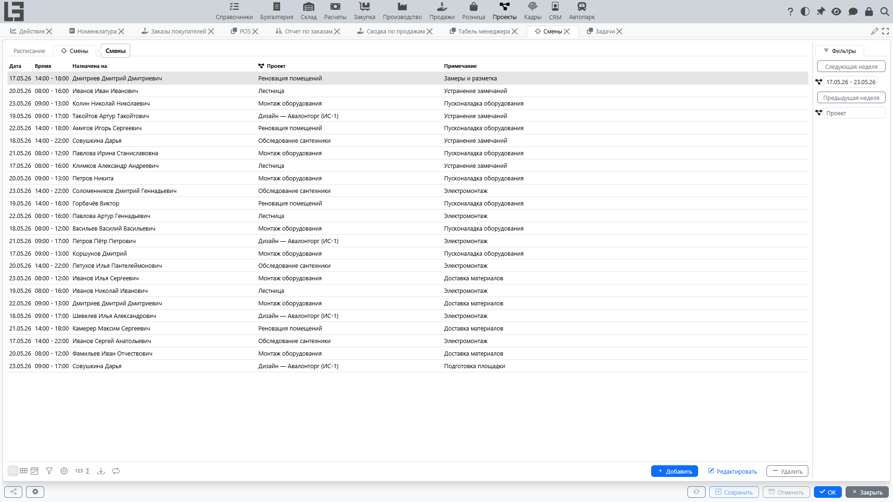
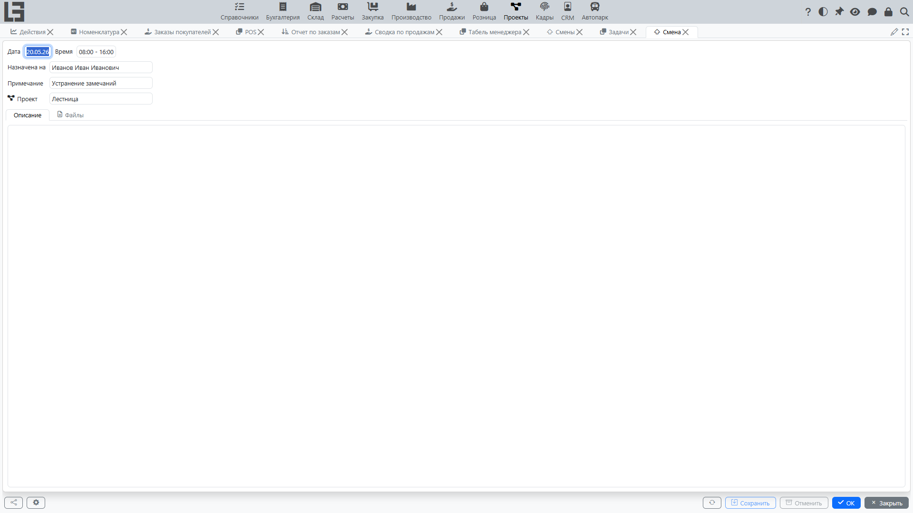
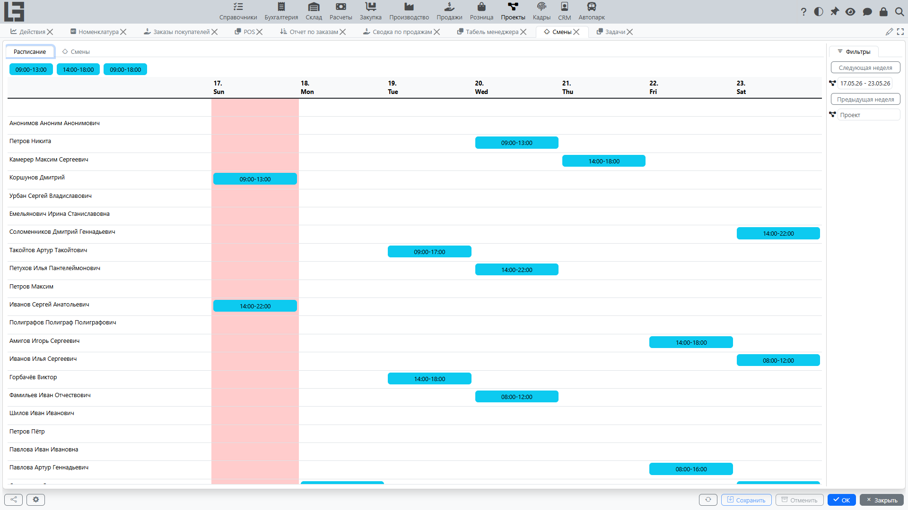
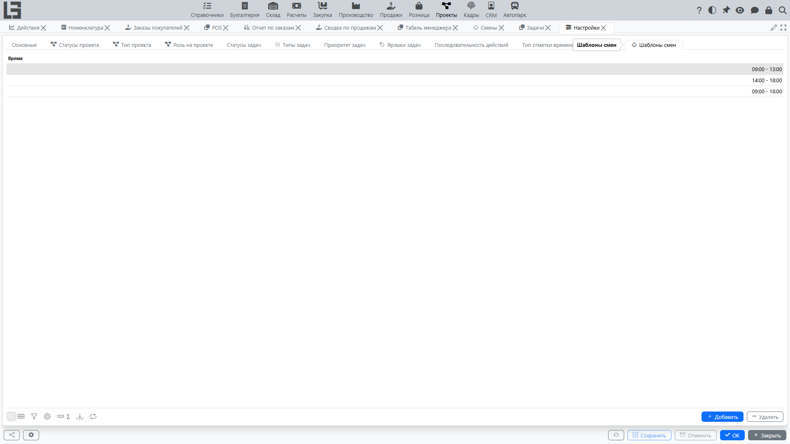

Функционал **«Смены»** используется для планирования рабочих смен сотрудников: кто работает, в какой день, в каком интервале времени и — при необходимости — по какому проекту.

## Где находится

Откройте **«Проекты» → «Операции» → «Смены»**.

Экран открывается на текущей неделе и содержит две вкладки:

- **«Расписание»** — визуальная недельная доска для планирования смен;
- **список** смен — обычная таблица записей.

Для перехода между неделями используйте кнопки **«Предыдущая неделя»** / **«Следующая неделя»** или поле интервала дат. Обе вкладки показывают смены выбранного периода.

## Карточка смены

В смене указываются:

- **Дата** — день смены;
- **Время** — интервал времени начала–окончания;
- **Назначена на** — сотрудник, который работает в смену;
- **Проект** — проект, к которому относится смена (необязательно);
- **Примечание** и **Описание**;
- прикреплённые **файлы**.

Чтобы открыть смену, дважды щёлкните её в списке (или используйте **«Редактировать»**).

## Представление «Расписание»

Вкладка **«Расписание»** показывает выбранную неделю в виде доски: строки — сотрудники, столбцы — дни. Над доской отображается ряд **шаблонов смен**.

На доске можно:

- **создать смену** — перетащите **шаблон смены** из ряда шаблонов в ячейку нужного сотрудника и дня; смена создаётся с интервалом времени из шаблона;
- **переместить смену** — перетащите существующую смену в другую ячейку, чтобы изменить её сотрудника и/или дату;
- **изменить или удалить смену** — щёлкните смену, чтобы открыть её, затем измените или удалите.

Вкладка **«Расписание»** удобна для визуального планирования недели, а вкладка **списка** — для плоского представления с фильтрами.

## Шаблоны смен

**Шаблон смены** — это заранее заданный интервал времени (например, утренняя смена `09:00–18:00`). Шаблоны ускоряют планирование в **«Расписании»**: вы перетаскиваете шаблон в ячейку, и новая смена получает интервал времени из шаблона.

Шаблоны смен настраиваются в форме **«Настройки»**, на вкладке **«Шаблоны смен»** — см. [Настройка](settings.md#шаблоны-смен).

## Смены и проекты

Смену можно связать с **[проектом](projects.md)**. Тогда:

- смена отображается в блоке **«Смены»** карточки проекта;
- в списке проектов показывается количество смен по проекту.

В списке смен смены также можно отфильтровать по проекту.

## Частые ситуации

#### Смена не видна в списке

На экране отображаются только смены выбранной недели. Проверьте интервал дат вверху экрана или используйте **«Предыдущая неделя»** / **«Следующая неделя»**.

#### В «Расписании» нет шаблонов смен для выбора

Шаблоны берутся с вкладки **«Шаблоны смен»** формы **«Настройки»**. Если список пуст, добавьте шаблоны, которые использует ваша организация — см. [Настройка](settings.md#шаблоны-смен).
