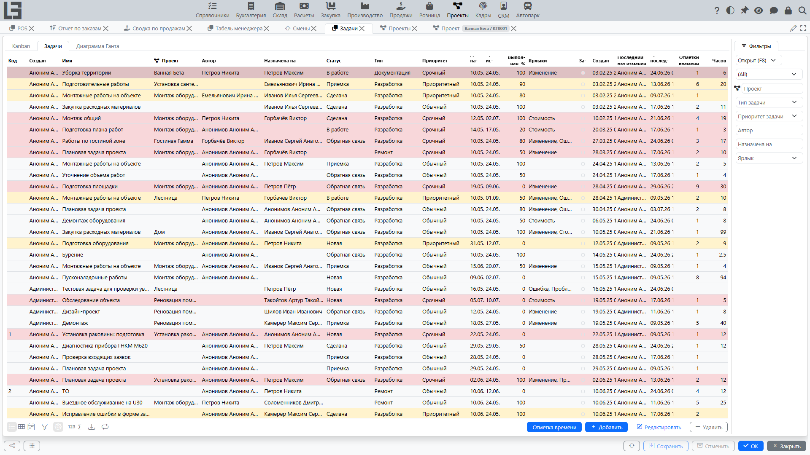
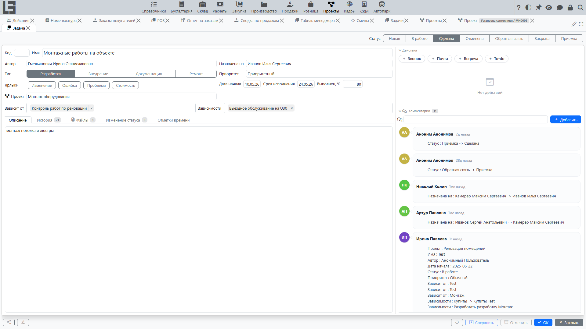
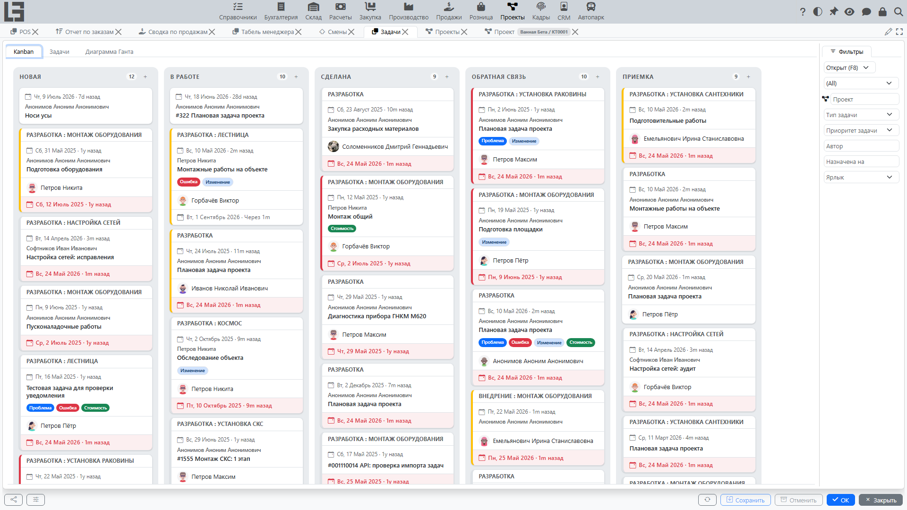
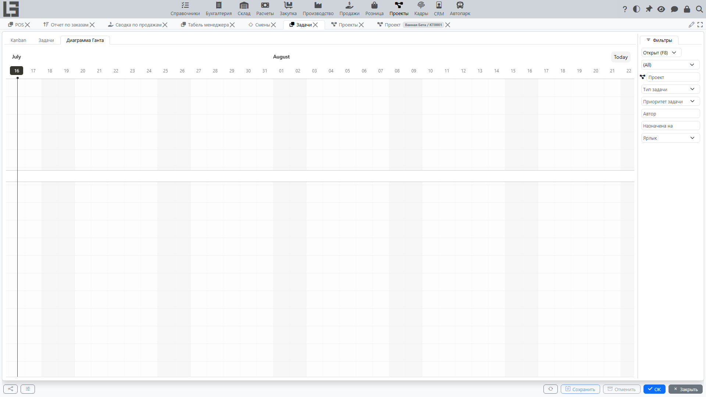

Страница описывает работу с задачами проекта: постановка, назначение, контроль статусов, учет истории изменений и использование представлений для контроля.

Задача — основная единица работы внутри проекта. Рекомендуется вести задачи так, чтобы по карточке задачи было понятно: что нужно сделать, кто отвечает, к какому сроку и на каком шаге находится выполнение.

## Основные данные задачи

В задаче обычно фиксируются:

- ID (формируется автоматически);
- наименование;
- проект;
- тип;
- статус;
- приоритет;
- ярлыки;
- автор (заполняется текущим пользователем, при необходимости можно изменить);
- исполнитель (сотрудник или команда);
- дата начала и срок исполнения;
- прогресс (% выполнения);
- описание, файлы и комментарии.

Задача без проекта может быть сохранена, только если у её автора есть доступ ко всем проектам (признак **«Доступ ко всем проектам»** либо отсутствие прямых назначений — см. **[доступ к проектам](team-and-roles.md#доступ-к-проектам)**); в остальных случаях система покажет сообщение «Не выбран проект для задачи». Если текущий пользователь назначен ровно на один проект, этот проект подставляется в новую задачу автоматически; при создании задачи из карточки проекта подставляется этот проект.

Набор допустимых статусов зависит от типа задачи и настраивается в карточке типа (см. **[типы задач](settings.md#типы-задач)**); переходы между статусами регулирует **[последовательность действий](settings.md#последовательность-действий)**.

#### Рекомендации по постановке задачи

- **Наименование** формулируйте как проверяемый результат (например, «Подготовить смету», «Согласовать макет», «Исправить ошибку в отчёте»).
- **Срок исполнения** задавайте сразу, чтобы задача попадала в контроль по срокам.
- **Исполнитель** должен быть один; если работу нужно разбить, создавайте отдельные задачи и при необходимости связывайте их через **[зависимости](#зависимости-задач)**.
- **Описание** используйте для деталей: контекст, ограничения, критерии готовности.
- В списке задач строки выделяются **цветом приоритета** — это помогает быстро просматривать очередь.

## Статусы и последовательность действий

Задача проходит состояния, которые задаются **[статусами задач](settings.md#статусы-задач)**. Переходы между статусами регулирует **[последовательность действий](settings.md#последовательность-действий)**.

Последовательность действий помогает избежать хаотичных изменений: например, нельзя сразу перевести задачу в завершенную, пока она не была взята в работу (точные правила зависят от настроек).

Если система не позволяет сменить статус, обычно причина в одном из вариантов:

- переход запрещен правилами последовательности действий;
- у пользователя нет прав на смену статуса;
- для типа задачи выбранный переход не предусмотрен настройками.

#### Что делать, если статус не меняется

1. Проверьте, какой статус установлен сейчас и какой статус вы пытаетесь выбрать.
2. Попробуйте выполнить промежуточный переход (если он предусмотрен).
3. Уточните у менеджера проекта или администратора, какие переходы разрешены и кому.

## Комментарии, файлы и история изменений

Для совместной работы используйте:

- комментарии — чтобы фиксировать решения, договоренности и уточнения;
- вложенные файлы — чтобы держать спецификации, скриншоты и другие материалы прямо в задаче;
- историю изменений — чтобы видеть, когда и кем менялись ключевые данные задачи.

#### Когда полезна история изменений

- при разборе «кто перенес срок и почему»;
- при спорных ситуациях по ответственности;
- при подготовке отчета о ходе работ.

## Учёт времени по задаче

Трудозатраты можно вносить прямо из карточки задачи (а также из всплывающего окна карточки на **[доске задач](#доска-задач)**), не переходя в общий список **[отметок времени](time-entries.md)**. Это рекомендуемый способ — он гарантирует, что запись будет привязана к правильной задаче и проекту.

## Представления для контроля выполнения

Помимо списка задач, для контроля выполнения могут использоваться специальные представления. Их набор зависит от настроек.

### Доска задач

Доска помогает контролировать поток работ по статусам. Используйте её для ежедневной работы команды: быстро видно, что в очереди, что выполняется и что завершено.

На доске отображаются только **открытые** задачи; колонки — незакрытые статусы в порядке сортировки (см. **[статусы задач](settings.md#статусы-задач)**). Если включён отбор по типу задачи, колонками становятся только статусы, допустимые для этого типа.

Во всплывающем окне карточки на доске список исполнителей ограничен активными сотрудниками, у которых уже есть открытые назначенные задачи; назначить любого другого исполнителя или команду можно в карточке задачи.

Рекомендации:

- обновляйте статусы сразу после смены состояния работы;
- не перемещайте задачу «на будущее», если работа фактически не началась;
- используйте комментарии при блокировках (что мешает и кто должен помочь).

### Диаграмма Ганта

Диаграмма Ганта используется для планирования по датам и визуального контроля сроков. Она удобна, когда важно согласовать календарный план проекта и оценить пересечения по задачам.

На диаграмме отображаются только задачи, у которых заполнены **дата начала** и **срок исполнения**.

Используйте диаграмму Ганта, когда:

- проект зависит от календарного плана (сроки фиксированы);
- есть много параллельных задач и нужно видеть пересечения;
- есть зависимости между задачами.

## Зависимости задач

При необходимости задавайте зависимости между задачами (например, когда одна работа не может начаться до завершения другой). Зависимости в системе — это парные связи между задачами (предшественник → последователь); иерархия «родительская — подзадачи» не реализована. Это помогает выстроить последовательность выполнения и уменьшить риск блокировок.

#### Практический пример

Если задача «Согласовать макет» зависит от задачи «Подготовить макет», то:

- сначала выполняется подготовка;
- затем начинается согласование;
- при переносе сроков первой задачи проверьте сроки второй.

## Уведомления

В зависимости от настроек система может рассылать уведомления об изменениях задачи — например, push-уведомление при назначении задачи на сотрудника или письмо со ссылкой на задачу. Какие каналы уведомлений включены, уточните у администратора.

## Типовые ситуации и решения

#### Задача не отображается у исполнителя

Проверьте:

- назначен ли исполнитель;
- находится ли задача в нужном проекте;
- есть ли у исполнителя доступ к этому проекту (см. **[доступ к проектам](team-and-roles.md#доступ-к-проектам)**);
- не включены ли фильтры (например, «Назначены мне», «Открыт»/«Закрыта» или отбор по статусам).

#### Исполнитель назначен, но не видит задачу

Система не запрещает выбрать исполнителем сотрудника без доступа к проекту — но задача не будет ему видна. Проверьте:

- есть ли у исполнителя доступ к проекту задачи (активное **[назначение](team-and-roles.md#назначения)** — напрямую или в составе команды — либо признак «Доступ ко всем проектам»);
- не скрывают ли задачу фильтры (см. выше).

Если не удаётся сохранить саму задачу, обычно причина в правах на изменение задачи либо в ограничениях статуса/типа (см. **[последовательность действий](settings.md#последовательность-действий)**).