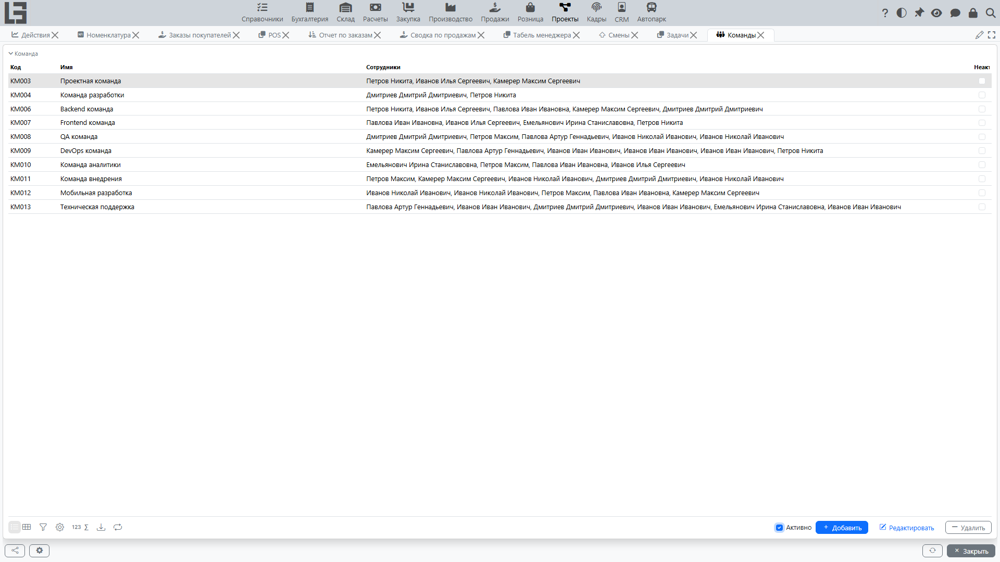

Страница описывает работу с участниками проекта: командой, ролями и назначениями.

Команду и роли рекомендуется вести с первых дней проекта: это упрощает назначение задач, контроль загрузки и отчетность по участию.

## Команда

Команда — это отдельный список сотрудников, который можно назначать **на несколько проектов одновременно**. Команды ведутся в **«Проекты» → «Настройка»**.

Это удобно, когда один и тот же состав работает на разных проектах или на нескольких направлениях внутри организации.

Важно учитывать:

- если вы добавили/убрали сотрудника из команды, то изменится и список сотрудников, назначенных на проект **во всех проектах**, где эта команда назначена;
- если для участия важен период, указывайте даты участия в назначении на проект (см. раздел «Назначения»).

#### Как назначить команду на проект

Назначение команды выполняется через список **назначений** в карточке проекта.

1. Откройте нужный проект.
2. Перейдите в раздел с назначениями (список участников проекта).
3. Добавьте новое назначение.
4. В поле участника выберите **команду** (а не конкретного сотрудника).
5. При необходимости укажите роль и период участия (даты начала/окончания).
6. Сохраните изменения.

После сохранения участниками проекта будут считаться все сотрудники, входящие в выбранную команду (с учетом периода участия и ваших прав доступа).

#### Что происходит при изменении состава команды

Если команда уже назначена на проект и вы изменили ее состав:

- новые сотрудники появятся в списке назначенных на проект;
- исключенные сотрудники перестанут считаться назначенными (если других назначений на этот проект для них нет).

Рекомендуется согласовывать изменения состава команды с менеджером проекта и фиксировать причины в комментариях проекта или задач.

## Роли на проекте

Роль на проекте отражает функцию участника (например, менеджер, исполнитель, наблюдатель — конкретный перечень зависит от настроек). Роли ведутся в **«Проекты» → «Настройка»** и используются для:

- разграничения обязанностей;
- настройки доступов и правил **[последовательности действий](settings.md#последовательность-действий)** (например, кому разрешено переводить задачу из одного статуса в другой);
- аналитики по участию сотрудников.

Рекомендации:

- договаривайтесь о смысле ролей заранее (что означает «исполнитель», «наблюдатель» и т. п.);
- если роль влияет на права доступа, изменения ролей выполняйте осознанно и согласованно.

## Назначения

Назначение связывает **участника** (сотрудника или команду) с **проектом** и фиксирует условия участия. Назначения ведутся в карточке проекта.

Назначение содержит:

- участника (сотрудника или команду);
- роль на проекте;
- период участия (даты «с» / «по» — «по» необязательна, означает бессрочное участие).

В списке назначений на карточке проекта есть фильтр **«Активные»**, который показывает только назначения, чей период участия покрывает текущую дату.

Рекомендуется поддерживать назначения в актуальном состоянии:

- добавлять участников при старте работ;
- закрывать назначения (проставлять дату «по»), если сотрудник больше не участвует;
- согласовывать роли на проекте с фактическими обязанностями.

> У задач нет отдельных записей назначения. Задача привязана к единственному **исполнителю** (сотруднику или команде) через своё поле «Назначено». Видимость задачи у этого пользователя определяется назначением на уровне проекта.

## Доступ к проектам

По умолчанию пользователь видит только те проекты, на которые он назначен (напрямую или в составе назначенной команды). Для пользователей, которым нужно видеть всё (например, руководитель подразделения или администратор), в карточке сотрудника есть признак **«Доступ ко всем проектам»**. Включение этого признака снимает фильтр по назначениям для данного пользователя.

## Типовые сценарии

#### Старт проекта

1. Назначьте менеджера проекта.
2. Сформируйте первичный состав команды.
3. Назначьте роли (если используется).
4. Создайте задачи и назначьте исполнителей из команды.

#### Подключение нового участника

1. Добавьте сотрудника в команду проекта.
2. Назначьте роль.
3. Передайте контекст: описание проекта, текущие задачи, правила статусов.
4. Назначьте задачи и сроки.

#### Замена исполнителя по задаче

1. Уточните причину замены и оставьте комментарий в задаче.
2. Назначьте нового исполнителя.
3. Проверьте сроки и зависимости.
4. При необходимости скорректируйте план и уведомите команду.

## Частые вопросы

#### Почему нельзя назначить задачу на сотрудника

Обычно причина в одном из вариантов:

- у сотрудника нет доступа к проекту (нет активного назначения и не установлен признак «Доступ ко всем проектам»);
- у вас нет прав на изменение задачи;
- выбранный тип задачи ограничивает список допустимых статусов, что косвенно может блокировать сохранение.