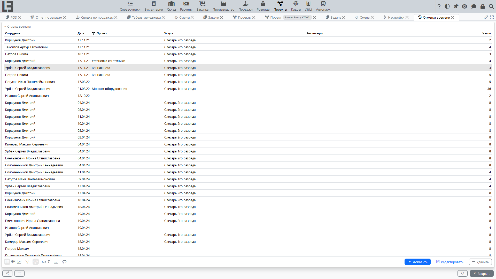

Страница описывает учет трудозатрат через отметки времени: зачем он нужен, как правильно вводить записи и как разбирать типовые ошибки.

## Для чего нужны отметки времени

Отметки времени позволяют:

- фиксировать фактически затраченное время по задачам и проектам;
- формировать данные для отчётности по трудозатратам;
- сравнивать плановые ожидания с фактом и улучшать планирование.

Кроме управленческого контроля, отметки времени часто используются для внутренней отчетности и анализа загрузки сотрудников.

## Как добавить отметку времени

Типовые сценарии:

- Из **карточки проекта или задачи** — откройте карточку, найдите блок отметок времени и создайте новую запись. Проект (и задача, если применимо) подставится автоматически.
- Из **общего списка отметок времени** — откройте **«Проекты» → «Операции» → «Отметки времени»** и создайте запись вручную; в этом случае проект и/или задачу выбирайте явно.
- Через **[табель](timesheets.md)** — введите часы в дневной сетке, система создаст или обновит соответствующие отметки времени.

Шаги:

1. Укажите дату, количество часов и тип отметки времени.
2. Привяжите запись к проекту и, если применимо, к задаче.
3. Сохраните запись.

> Если сотрудник назначен ровно на один проект, при создании отметки времени этот проект подставляется автоматически.

#### Рекомендации по заполнению

- вносите время по факту, как можно ближе к дате выполнения работ;
- не «копите» отметки времени на конец месяца — так повышается риск ошибок;
- если вы работали по нескольким задачам, фиксируйте время отдельными записями;
- если в организации используются типы отметок времени, выбирайте тип, соответствующий характеру работ;
- если для выбранного типа настроены **шаблоны часов**, типовое значение часов можно вставить быстро, без ручного ввода.

## Проверки и ограничения

В зависимости от настроек могут действовать ограничения:

- для некоторых типов отметок времени установлен признак **«Обязателен проект»** — без проекта запись не сохранится (система покажет сообщение «Не выбран проект для отметки времени»);
- нельзя сохранить отметку времени, у которой **задача** относится к проекту, отличному от указанного в самой отметке (система покажет сообщение «Задача отметки времени не соответствует проекту»).

## Частые ситуации

#### Не удаётся добавить отметку времени

Проверьте:

- что выбран проект/задача, по которой ведется учет (требуется для типов отметок с признаком «Обязателен проект»);
- что у пользователя есть право на создание отметок времени.

#### Сообщение «Не выбран проект для отметки времени»

Сообщение появляется при сохранении отметки времени без проекта, если для выбранного типа отметки времени установлен признак «Обязателен проект».

Что сделать:

1. Откройте нужный проект или задачу.
2. Создайте отметку времени из карточки проекта/задачи.
3. Если отметка времени вводится из общего списка — явно выберите проект и/или задачу.

#### Сообщение «Задача отметки времени не соответствует проекту»

Если отметка времени привязана к задаче, которая относится к другому проекту, система запретит сохранение.

Что сделать:

- проверьте, в каком проекте находится задача;
- при необходимости исправьте проект у задачи или выберите корректную задачу.