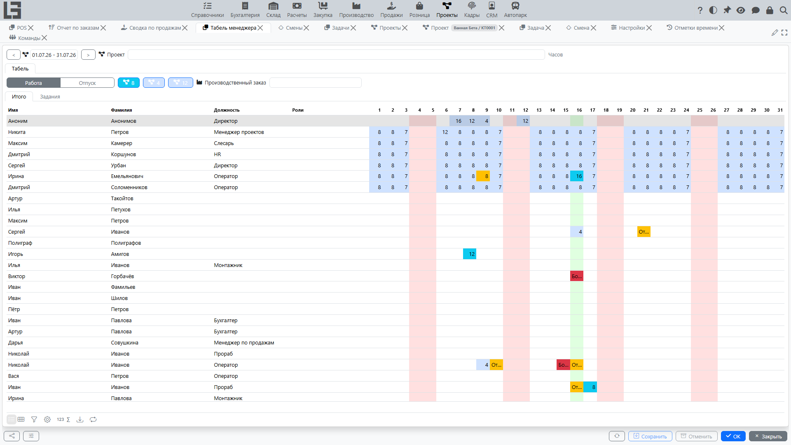
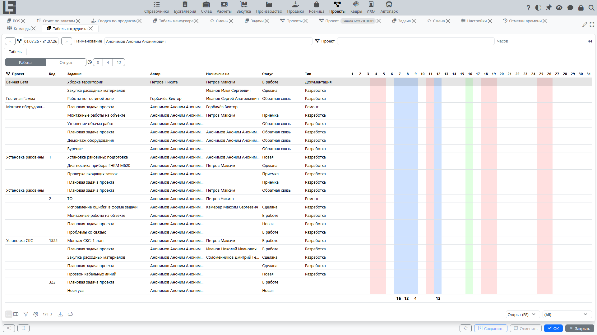

Страница описывает формы табеля:

- **Табель менеджера** — для контроля и корректировки трудозатрат сотрудников по дням в выбранном проекте.
- **Табель менеджера мобильный** — упрощённый однодневный вариант табеля менеджера для телефона.
- **Табель сотрудника** — для внесения и просмотра трудозатрат по задачам (обычно в рамках выбранного проекта).

Табель работает на данных **отметок времени**. Если в организации учет времени ведётся строго по задачам и проектам, табель помогает быстро заполнить/проверить часы без перехода в отдельные списки.

> Подробности про сами записи времени см. на странице [Отметки времени](time-entries.md).

## Общие принципы

В настольных формах (табель менеджера и табель сотрудника) используются общие элементы:

- **Период** — выбирается интервал дат (как правило, месяц). В заголовке доступны кнопки перехода к предыдущему/следующему месяцу. В мобильном табеле вместо периода выбирается один день.
- **Проект** — позволяет ограничить учет и просмотр часов рамками конкретного проекта.
- **Тип отметки времени** — выбирается вид работ (например, «Разработка», «Аналитика», «Поддержка» — конкретный перечень зависит от настроек).
- **Шаблон часов** (если используется) — позволяет быстро подставлять типовое значение часов при вводе.

### Как вводятся часы

Часы вводятся прямо в таблице.

Обычно доступны два варианта:

1. **Ввод значения вручную** — вы указываете число часов за выбранный день.
2. **Быстрый ввод по шаблону** — если выбран шаблон часов, система подставляет его значение. Повторное применение того же шаблона к заполненной ячейке удаляет запись.

Если значение часов очистить (сделать пустым/нулевым), соответствующие отметки времени за день могут быть удалены (в зависимости от правил учета).

Если включена настройка **автосохранения часов** («Автоматически сохранять часы в табеле», задаётся в **«Проекты» → «Настройка» → «Настройки»**), изменения в ячейках записываются в базу сразу при вводе — это относится к обеим формам табеля.

### Подсветка дней

Для удобства контроля в таблице обычно используется подсветка:

- текущий день выделяется отдельно;
- выходные дни могут подсвечиваться другим цветом;
- если за день у сотрудника есть отметки времени разных типов, день может подсвечиваться как «требующий внимания».

## Табель менеджера

Откройте **«Проекты» → «Процессы» → «Табель менеджера»**.

### Назначение

Форма предназначена для менеджеров и руководителей, которым нужно:

- контролировать заполнение времени сотрудниками;
- быстро видеть загрузку по дням;
- при необходимости корректировать часы в разрезе проекта.

### Что отображается

В табеле отображается таблица:

- строки — **сотрудники**;
- колонки — **дни выбранного периода**;
- значения — **часы**.

Дополнительно в строке сотрудника могут отображаться сведения о должности и ролях в проекте (если роли ведутся).

### Ограничение списка сотрудников

Список сотрудников в табеле, как правило, формируется из:

- **активных** участников, назначенных на выбранный проект в выбранном периоде;
- сотрудников, у которых уже есть часы/отметки времени по выбранному проекту в выбранном периоде (независимо от того, активны они или нет);
- если на выбранный проект нет ни одного назначения — всех **активных** сотрудников (для пользователя с доступом ко всем проектам: признак «Доступ ко всем проектам» либо отсутствие прямых назначений — см. **[доступ к проектам](team-and-roles.md#доступ-к-проектам)**).

### Ввод и действия

При изменении ячейки (день/сотрудник) система:

- создаёт/обновляет отметку времени нужного типа — если на форме выбран **тип отметки времени** (и выбран проект, либо существующая запись за день ещё не привязана к проекту);
- открывает форму со списком отметок времени за этот день и сотрудника — в остальных случаях (прежде всего, когда тип отметки времени не выбран).

Если для выбранного типа настроены **шаблоны часов**, рядом с типом отображаются кнопки шаблонов — нажатие проставляет часы шаблона в выбранную ячейку.

#### Копирование и очистка часов (контекстное меню)

В табеле руководителя обычно доступны действия по дню (через контекстное меню в ячейке дня):

- **Копировать** — сначала очищает выбранный день, затем копирует в него все отметки времени с ближайшего предыдущего дня, где были записи. Переносятся сотрудник, проект, тип и часы; привязка к задаче, шаблон часов и описание не копируются.
- **Очистить** — удаляет все отметки времени за выбранный день.

> Действия применяются **ко всему дню** — ко всем сотрудникам в рамках выбранного проекта (или записям без проекта, если проект не выбран), а не к отдельной ячейке.

Если включена настройка **автосохранения часов** (см. выше), изменения сразу записываются, поэтому «Очистить» всегда запрашивает подтверждение, а «Копировать» — если в целевом дне уже есть записи (они будут удалены).

#### Ввод часов по задаче

Таблица сотрудников в табеле менеджера содержит две вкладки: **«Итого»** и **«Задания»**. На вкладке «Задания» можно выбрать конкретную задачу (открытую и относящуюся к выбранному проекту) и вводить часы по ней; в ячейках при этом показываются часы по выбранной задаче на фоне общего количества часов сотрудника за день.

### Типовые ситуации

#### При вводе часов открывается список отметок времени

Список отметок времени открывается, если на форме **не выбран тип отметки времени** (а также если не выбран проект, а записи за день уже привязаны к проекту). Обычно это нужно, когда за выбранный день уже есть записи и требуется уточнить детализацию (например, распределение по задачам).

Что сделать:

1. Откройте список отметок времени, который показывает система.
2. Проверьте, по каким работам/задачам уже есть записи.
3. При необходимости скорректируйте часы или тип/проект у записи.

## Табель менеджера мобильный

Откройте **«Проекты» → «Процессы» → «Табель менеджера мобильный»**.

Упрощённый вариант табеля менеджера для работы с телефона:

- выбирается **один день**; кнопки позволяют перейти на день или неделю назад/вперёд;
- в списке — **активные** сотрудники, назначенные на выбранный проект **на текущую дату** (либо все активные сотрудники — для пользователя с доступом ко всем проектам, если на проект нет назначений);
- часы вводятся по сотрудникам за выбранный день (при выбранном типе отметки времени);
- доступны кнопки **шаблонов часов** и действия **«Копировать»** / **«Очистить»** за день (с подтверждением);
- изменения записываются сразу.

## Табель сотрудника

Откройте **«Проекты» → «Процессы» → «Табель сотрудника»**.

### Назначение

Форма предназначена для сотрудников и помогает:

- ежедневно вносить часы по задачам;
- видеть, по каким задачам и в какие дни внесено время;
- контролировать заполнение табеля за месяц.

### Что отображается

В табеле сотрудника отображается список задач и таблица часов:

- строки — **задачи**;
- колонки — **дни выбранного периода**;
- значения — **часы по задаче**.

Также могут отображаться сведения по задаче (наименование, автор, исполнитель, статус, тип). Если проект не выбран, дополнительно может показываться проект задачи.

> Итог часов за период и суммы по дням считаются по **всем** отметкам времени сотрудника, а не только по выбранному проекту, поэтому итог может быть больше суммы видимых строк.

### Выбор сотрудника

Обычно по умолчанию выбран текущий пользователь. Пользователь с доступом ко всем проектам (признак **«Доступ ко всем проектам»** либо отсутствие прямых назначений) может переключить сотрудника (например, для помощи в заполнении или контроля).

### Отбор задач

Табель показывает задачи, которые:

- относятся к выбранному проекту (если проект выбран);
- относятся к проектам, на которые сотрудник назначен в выбранном периоде, либо уже имеют внесённые сотрудником часы за период;
- задачи проектов, на которые никто не назначен, дополнительно видны пользователю с доступом ко всем проектам;
- удовлетворяют фильтрам по состоянию и принадлежности.

Как правило, доступны фильтры:

- **«Открыт» / «Закрыта»** — по состоянию задач;
- **«Мои задачи»** — где сотрудник является автором;
- **«Назначены мне»** — где сотрудник указан исполнителем.

### Ввод часов

При изменении ячейки (день/задача) система создаёт или обновляет отметку времени.

Рекомендации:

- сначала выберите проект (если учет ведётся строго по проектам);
- затем работайте с задачами этого проекта;
- вносите время как можно ближе к фактической дате выполнения работ.

## Права и ограничения

Доступность табелей зависит от прав:

- сотрудник обычно видит только свой табель;
- менеджер/руководитель может видеть табель по сотрудникам проекта;
- доступ «ко всем проектам» расширяет набор данных, доступных для просмотра и (в некоторых случаях) редактирования.

Если вы не видите нужный проект, сотрудников или задачи, проверьте:

- выбранный период;
- выбранный проект;
- назначение на проект и актуальность периода участия;
- фильтры в форме;
- права доступа.