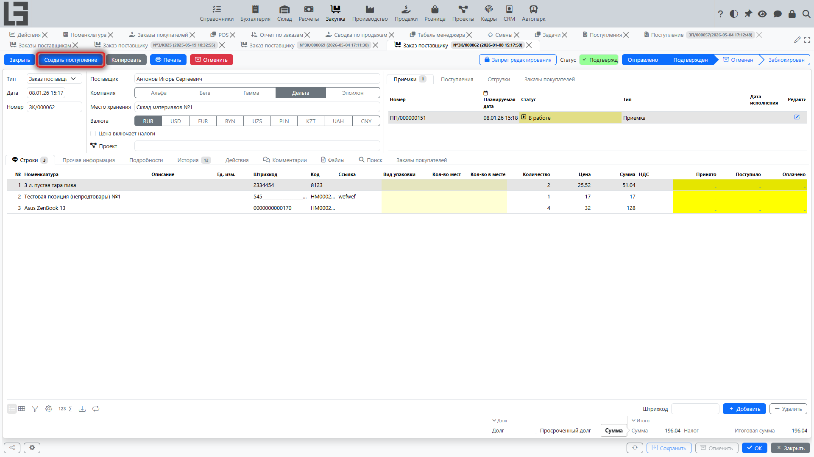
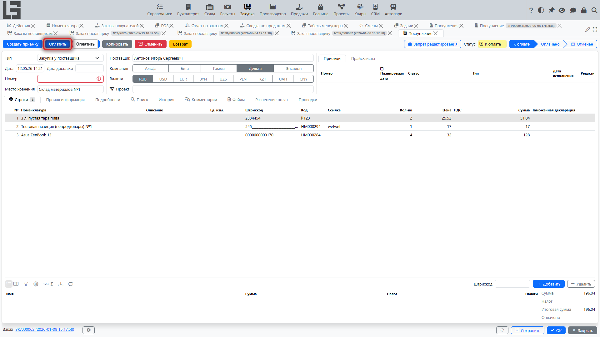

Поступление фиксирует покупку в учёте и сумму к оплате [поставщику](../masterdata/partners.md). На практике поступление часто оформляют на основании заказа поставщику, чтобы автоматически перенести реквизиты и строки.

## Где находится

Обычно поступления доступны в разделе **[«Расчёты»](../invoicing/invoicing.md) → «Операции» → «Поступления»**.

Если в вашей конфигурации включена связь с заказами, поступление также можно создать из карточки **[заказа поставщику](orders.md)**.

## Связь с заказом поставщику

Поступление может создаваться на основании подтверждённого заказа. В этом случае:

- реквизиты ([организация](../masterdata/partners.md), [поставщик](../masterdata/partners.md), [валюта](../masterdata/currencies.md), [условия оплаты](../invoicing/settings.md#условия-оплаты) и т.п.) обычно подставляются из заказа;
- строки поступления формируются по строкам заказа;
- по этой связи система считает, сколько уже оформлено поступлениями и сколько осталось оформить.

Практический смысл: один заказ можно оформлять **несколькими поступлениями** и **частями**.

## Когда доступно создание поступления из заказа

Обычно поступление на основании заказа используют, когда включён финансовый контур (раздел [**«Расчёты»**](../invoicing/invoicing.md)) и требуется зафиксировать сумму к оплате [поставщику](../masterdata/partners.md).

Действие **«Создать поступление»** появляется в карточке заказа, когда:

1. Заказ находится в статусе **«Подтверждён»**.
2. Для типа заказа настроены тип поступления и режим оформления (см. ниже).
3. По заказу есть остаток к оформлению (поле **«К оформлению»** по строкам).

### Режим оформления

В типе заказа задаётся, какое количество переносится в поступление из строк заказа:

- **«Заказанное количество»** — в поступление подставляется заказанное количество за вычетом уже оформленного в активных поступлениях. Это режим по умолчанию.
- **«Принятое количество»** — в поступление подставляются только те количества, по которым есть факт приёмки (из связанных активных приемок). Доступно при включённом складском контуре; действие «Создать поступление» в этом режиме появится только после приёмки части товара.

### Контроль по строкам

В строках заказа отображаются справочные поля:

- **«Оформлено»** — количество, попавшее в активные поступления (не отменённые, в статусе «к оплате» или выше);
- **«Оплачено»** — количество, попавшее в полностью оплаченные поступления.

Строки подсвечиваются, если оформлено/оплачено меньше заказанного количества; по клику открывается список связанных поступлений.

## Как создать поступление на основании заказа

1. Откройте [заказ поставщику](orders.md).
2. Выполните действие **«Создать поступление»** (если оно доступно в вашей конфигурации).
3. В открывшемся поступлении проверьте реквизиты (обычно заполняются автоматически из заказа):
   - [организация](../masterdata/partners.md);
   - [поставщик](../masterdata/partners.md);
   - [валюта](../masterdata/currencies.md);
   - [условия оплаты](../invoicing/settings.md#условия-оплаты);
   - реквизиты поставщика/примечание (если заполнялись в заказе).
4. Проверьте строки поступления:
   - [номенклатура](../masterdata/items.md) и описание;
   - количество (обычно подставляется «к оформлению»: заказанное количество за вычетом уже оформленного в других поступлениях);
   - цена.
5. При необходимости скорректируйте количества/цены по факту документов поставщика.
6. Переведите поступление в рабочий статус согласно правилам вашей конфигурации (например, «к оплате»).

## Несколько поступлений по одному заказу (частичное оформление)

Если поставка и/или документы поставщика приходят частями, допускается несколько поступлений по одному заказу:

- первое поступление закрывает часть позиций/количества;
- следующее поступление оформляется на оставшуюся часть;
- в заказе обычно можно контролировать «сколько уже оформлено» и «сколько осталось».

## Оплата поступления

Далее цепочка обычно такая:

1. **Поступление** — фиксирует сумму к оплате [поставщику](../masterdata/partners.md).
2. **Исходящий платёж** — фиксирует оплату и уменьшает задолженность (после [разнесения оплат](../invoicing/payments.md)).

См. также: [Поступления](../invoicing/bills.md), [Исходящие платежи](../invoicing/outgoing-payments.md), [Разнесение оплат](../invoicing/payments.md).

## Ограничения при закрытии/фиксации заказа

В некоторых конфигурациях действует правило «нельзя закрыть/зафиксировать заказ, если он оплачен не полностью».

Если вы столкнулись с запретом:

1. Проверьте, оформлены ли поступления по всем строкам.
2. Проверьте, выполнено ли разнесение исходящих платежей по поступлениям.
3. Убедитесь, что поступления и платежи не отменены.

См. также: [Настройки](settings.md).