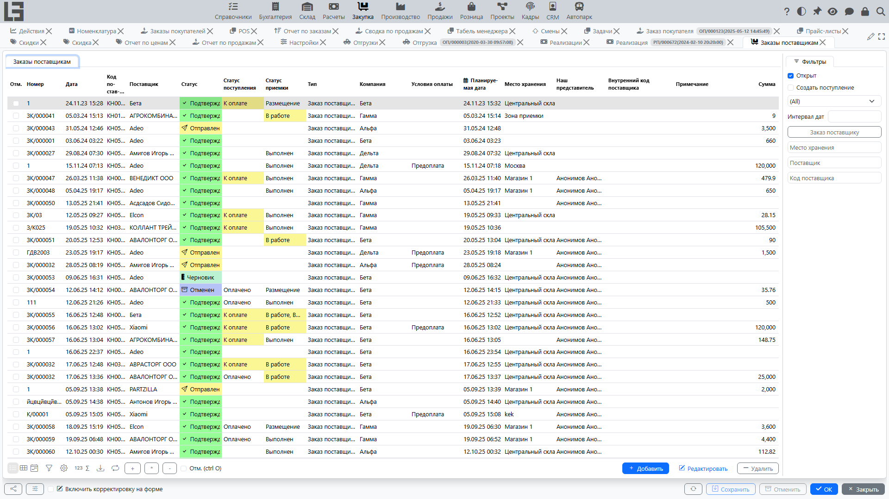
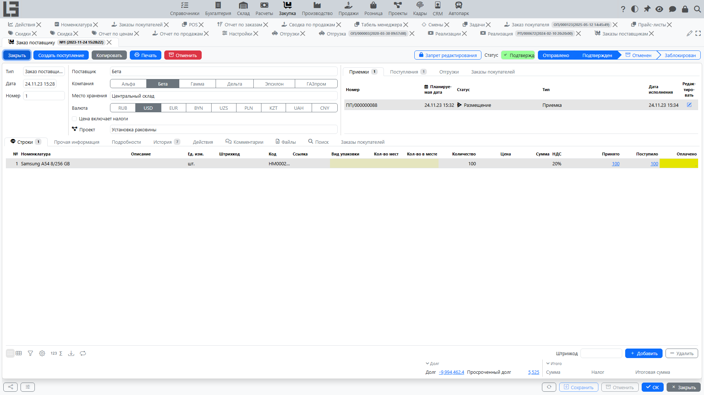

## Где находится

Основные формы для работы с заказами находятся в разделе **«Закупка» → «Операции» → «Заказы поставщикам»**.

Список имеет фильтр по умолчанию **«Открыт»**, скрывающий закрытые заказы. Действия по статусам (**«Отправить»**, **«Подтвердить»**, **«Отменить»**, **«Закрыть»**) можно применять сразу к нескольким выделенным заказам.

## Назначение

**Заказ поставщику** фиксирует договорённость с [поставщиком](../masterdata/partners.md) о поставке и используется для:

- планирования закупок и сроков поставки;
- согласования цены и количества;
- контроля исполнения (что уже принято/оформлено/оплачено — в зависимости от включённых контуров);
- создания связанных документов (поступления, приемки и др. — если включены соответствующие модули).

## Создание и заполнение

При создании заказа обычно заполняют:

- **[поставщика](../masterdata/partners.md)**;
- **[компанию](../masterdata/partners.md)**;
- **[место хранения](../inventory/locations.md)** (если используется [складской контур](../inventory/inventory.md));
- **[валюту](../masterdata/currencies.md)** (если используется многовалютность);
- **[условия оплаты](../invoicing/settings.md#условия-оплаты)** (если используются);
- **планируемую дату** (ожидаемая поставка);
- **примечание** и **внутренний код поставщика**.

В подвале карточки отображаются **«Долг»** и **«Просроченный долг»** поставщика; нажатие на значение открывает детальную расшифровку задолженности по поставщику.

### Строки заказа

В строках указывают:

- [номенклатуру](../masterdata/items.md);
- количество ([единица измерения](../masterdata/uom.md) подставляется из номенклатуры);
- цену;
- сумму (обычно рассчитывается автоматически);
- [налоги](../invoicing/taxes.md) (если используются).

Если в [типе заказа](settings.md) включена настройка **«Показывать количество мест»**, в строках дополнительно отображаются колонки упаковок. Для поставщиков с включённой настройкой **«Другие единицы измерений»** в строках появляются редактируемые колонки в единицах измерения поставщика.

### Подбор номенклатуры

В таблице подбора номенклатуры отображаются вспомогательные колонки: остатки по месту хранения заказа (**«Остаток»**, **«Ожидается»**, **«Доступно»**), количество **«Предыдущий заказ»** и цена из прайс-листа поставщика с фильтром **«В прайс-листе»**. Цены в строках заполняются автоматически из [прайс-листа](pricelists.md) поставщика или, если цены в прайс-листе нет, из себестоимости номенклатуры.

### Автоматическое заполнение заказа

Если включено планирование складских отгрузок, карточка заказа поставщику может рассчитывать рекомендуемые количества закупки в таблице номенклатуры.

1. Выберите **поставщика**, **место хранения** и **дату**.
2. Проверьте поля **Дата с** и **Дата по** над таблицей номенклатуры. При выборе поставщика система заполняет период относительно даты заказа: от количества дней, указанного в поле **Период заказа** поставщика, до дня перед датой заказа. Если период у поставщика не задан, используется 7 дней. Период можно изменить вручную перед заполнением заказа. Если после этого меняете дату заказа, проверьте эти даты перед запуском **Автозаказа**.
3. Используйте фильтр **Автозаказ**, чтобы показать только позиции с рекомендуемым количеством.
4. Выполните действие **Автозаказ**.

В таблице номенклатуры отображаются справочные колонки:

- **Планировалось** и **Отгружено** — количества по отгрузкам за выбранный период;
- **Ожидает отгрузку** — текущая потребность по отгрузкам, которая ещё не отгружена (не ограничивается выбранным периодом);
- **Автозаказ** — рекомендуемое количество к закупке, округлённое вверх до закупочной упаковки номенклатуры, если она настроена.

Действие **Автозаказ** добавляет строки только для позиций, которые сейчас видны в таблице, имеют положительное значение **Автозаказ** и ещё не добавлены в заказ. Существующие количества в строках не перезаписываются.

Если включено производство, этот же расчёт также учитывает потребность в материалах: **Ожидает расхода** из производственных заказов, ожидающих выполнения, и **Израсходовано** по производственным заказам в статусе «Выполнен» за выбранный период.

## Статусы и действия

В заказах поставщикам используется типовой жизненный цикл:

1. **Черновик** — заказ можно свободно редактировать; статус по умолчанию для нового заказа.
2. **Отправлен** — заказ отмечен как отправленный действием **«Отправить»**. Письмо поставщику по электронной почте отправляется, только если в [типе заказа](settings.md) задан **«Шаблон по умолчанию»** (там же настраиваются тема, тело, печатная форма-вложение и адрес копии; адрес копии получает скрытую копию письма); иначе действие только меняет статус. Переход доступен из «Черновика»; из «Отправлен» можно сразу перейти в «Подтвержден».
3. **Подтвержден** — заказ подтверждён для исполнения. Переход доступен из «Черновика» или «Отправлен». В этом статусе становятся доступными действия **«Создать поступление»** (если есть остаток к оформлению) и создание/обновление приемки (если в типе заказа задан **«Тип приемки»**).
4. **Закрыт** — заказ закрыт для дальнейшей работы (например, после полного исполнения). Переход доступен только из «Подтвержден» действием **«Закрыть»**. В [типе заказа](settings.md) можно включить ограничения, запрещающие закрытие при активных приемках, неполной приемке или неполной оплате.
5. **Отменен** — заказ исключён из дальнейшей обработки. Переход доступен из всех статусов, кроме «Черновика» и «Отменен».

Поведение статусов может отличаться в зависимости от настроек. Как правило, при переходе к подтверждению возрастает количество ограничений на изменения.

### Отправка заказа поставщику

Если в вашей конфигурации настроена отправка, в карточке заказа доступно действие **«Отправить»**:

- формируется печатная форма по выбранному шаблону;
- письмо отправляется на электронную почту поставщика;
- заказ переводится в статус **«Отправлен»**.

### Подтверждение заказа

Действие **«Подтвердить»** фиксирует готовность заказа к дальнейшим операциям.

После подтверждения могут становиться доступными связанные документы (например, приемка или поступление), а также контроль исполнения по строкам.

### Отмена заказа

Действие **«Отменить»** помечает заказ как отменённый.

Обычно отменённые заказы исключаются из дальнейших автоматических операций и отбора в процессах.

## Связанные документы и контроль исполнения

Набор связанных документов зависит от включённых модулей.

### Приемки (если используется [складской контур](../inventory/inventory.md))

Для подтверждённого заказа система может:

- показывать, **сколько уже принято** по каждой строке;
- вести список связанных **приемок** в карточке заказа;
- создавать приемку в статусе **«В работе»**, чтобы склад мог начать приём товаров.

Подробнее: [Приемки по заказам поставщикам](receipts.md).

### Поступления и оплата (если используется раздел [«Расчёты»](../invoicing/invoicing.md))

В карточке заказа может отображаться список связанных **поступлений**.

Поступление можно создать из заказа (если в вашей конфигурации это включено). Подробнее: [Поступления по заказам поставщикам](bills.md).

Цепочка обычно такая:

1. **Поступление** — фиксирует сумму к оплате поставщику.
2. **Исходящий платёж** — фиксирует оплату и уменьшает задолженность (после разнесения).

См. также: [Поступления](../invoicing/bills.md), [Исходящие платежи](../invoicing/outgoing-payments.md), [Разнесение оплат](../invoicing/payments.md).

### Заказы покупателей (если используется раздел [«Продажи»](../sales/orders.md))

В карточке заказа поставщику есть вкладка **«Заказы покупателей»**, где можно добавить строки подтверждённых [заказов покупателей](../sales/orders.md): строки заказа поставщику создаются или обновляются на нужные количества, и заказ поставщику закрывает связанную потребность продаж.

## Дополнительные возможности

### Вложения к заказу

К заказу можно прикреплять файлы (например, спецификации, переписку, коммерческие предложения) и просматривать их в карточке документа.

### Копирование заказа

Для ускорения работы можно создать новый заказ копированием существующего и затем скорректировать реквизиты и строки.
