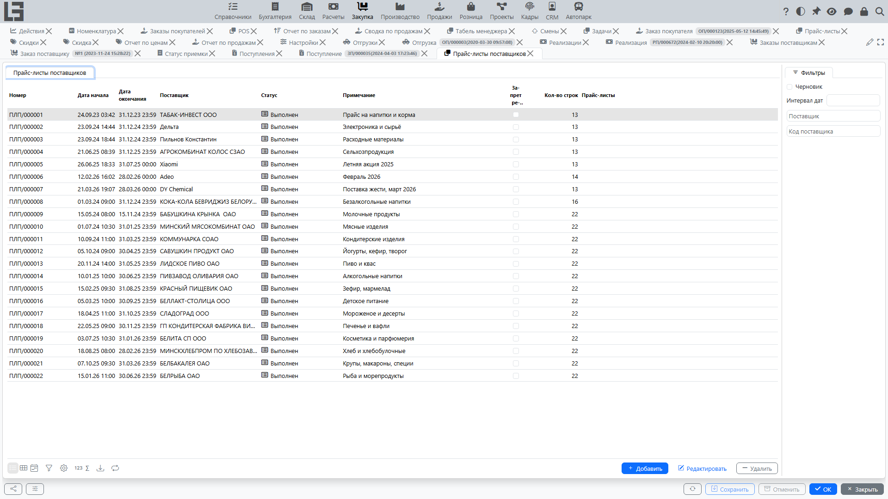
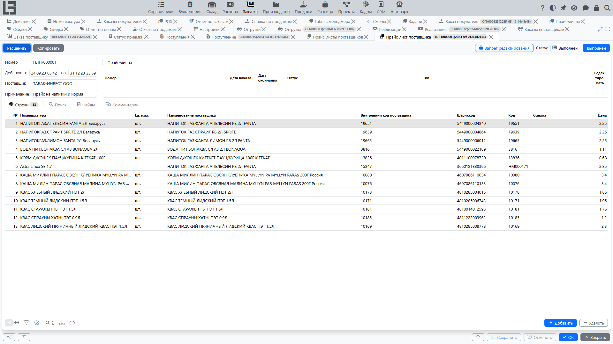

## Где находится

Формы для работы с прайс-листами обычно находятся в разделе **«Закупка» → «Операции» → «Прайс-листы поставщиков»**.

## Назначение

**Прайс-лист** хранит цены [поставщика](../masterdata/partners.md) и используется для:

- подготовки закупочных цен;
- подстановки цен при оформлении [заказов поставщикам](orders.md) и [поступлений](bills.md);
- фиксации изменений цен по периодам.

## Как устроен прайс-лист

В прайс-листе обычно указывают:

- [поставщика](../masterdata/partners.md);
- период действия (дата начала/окончания);
- примечание.

### Строки прайс-листа

В строках указывают:

- [номенклатуру](../masterdata/items.md);
- цену;
- при необходимости — наименование и код номенклатуры у поставщика (колонки **«Наименование поставщика»** и **«Внутренний код поставщика»**).

Строки также можно добавлять на вкладке **«Поиск»** карточки прайс-листа: там отображаются дерево категорий и список номенклатуры с редактируемой колонкой **«Цена»** — введите цену для позиции, чтобы добавить её в прайс-лист.

Если у поставщика установлен признак **«Другие единицы измерений»**, в строках дополнительно отображается колонка **«Ед. изм. контрагента»**. Эта единица измерения переносится в заказы поставщику, а цена пересчитывается по соотношению между единицей номенклатуры и единицей поставщика.

## Комментарии и файлы

В карточке прайс-листа может быть лента комментариев:

- добавляйте комментарии для фиксации договорённостей и источника цен;
- просматривайте дату/время и автора комментария.

На вкладке **«Файлы»** хранятся файлы, приложенные к прайс-листу (например, исходный файл импорта).

## Статусы прайс-листа

Прайс-лист обычно проходит два статуса:

1. **Черновик** — значения цен можно изменять; список прайс-листов можно отфильтровать по фильтру **«Черновик»**.
2. **Выполнен** — прайс-лист принят в работу; цены становятся источником для подстановок в заказы поставщикам.

Перевод в «Выполнен» выполняется действием **«Провести»** в карточке прайс-листа.

Прайс-лист становится недоступным для изменения, если для его статуса включён признак **«Запрет редактирования»** в [настройках закупки](settings.md) (**«Закупка» → «Настройка» → «Настройки»**); кроме того, любой прайс-лист можно заблокировать вручную переключателем с замком в его карточке.

## Как применяются цены

При подстановке цен в документы:

- учитываются только прайс-листы в статусе «Выполнен», период действия которых охватывает дату документа;
- если подходит несколько прайс-листов, используется тот, у которого дата начала позже;
- если цена в прайс-листах не найдена, используется себестоимость номенклатуры.

Цены подставляются в [заказы поставщикам](orders.md) и [поступления](bills.md). Действующий прайс-лист также определяет поставщика по умолчанию при автоматическом создании заказов поставщикам на заказываемую номенклатуру.

## Импорт цен из внешнего источника

Если для [поставщика](../masterdata/partners.md) определяется **тип импорта прайс-листа** (собственный или по умолчанию), в карточке прайс-листа этого поставщика появляется действие **«Импорт»**:

1. В разделе **«Закупка» → «Настройка» → «Настройки»** создайте/выберите тип импорта прайс-листа и задайте скрипт (например, парсинг XLSX/CSV или вызов внешнего API).
2. На форме редактирования типа импорта откройте вкладку **«Поставщики»** и установите флажок **«Вкл.»** для этого поставщика.
3. Создайте прайс-лист этого поставщика и нажмите **«Импорт»** — скрипт заполнит строки автоматически.

Действие **«Импорт»** появляется всегда, когда для прайс-листа определяется тип импорта — собственный тип поставщика или тип по умолчанию; для прайс-листа, недоступного для изменения, действие будет недоступно.

## Импорт прайс-листа

Строки прайс-листа можно импортировать из внешнего файла с помощью настраиваемых **типов импорта**.

### Типы импорта

Откройте **«Закупка» → «Настройка» → «Настройки»** и используйте блок **Типы импорта прайс-листа** для управления типами импорта. Для каждого типа можно задать:

- **Имя** — отображается пользователю при выборе типа;
- **Скрипт** (вкладка «Скрипт») — необязательный скрипт, выполняемый действием **«Импорт»**; действие **«Сгенерировать»** строит готовый скрипт импорта из XLS по буквам колонок и начальной строке;
- **Промпт** (вкладка «Импорт (GPT)») — инструкции, отправляемые в GPT (заполняется разумным значением по умолчанию действием **«По умолчанию»**).

На форме редактирования типа импорта также можно:

- отметить поставщиков, для которых используется этот тип (вкладка **«Поставщики»**, флажок **«Вкл.»**) — у каждого поставщика может быть только один тип импорта;
- отметить тип как **По умолчанию** (переключатель) — он используется как резервный для поставщиков, у которых не задан собственный тип импорта.

### Тип импорта по умолчанию

Если у поставщика прайс-листа не задан тип импорта, система использует тип, отмеченный как **По умолчанию** на форме редактирования типа импорта. Кнопка **Импорт** на карточке прайс-листа отображается всегда, когда доступен какой-либо тип импорта (по поставщику или по умолчанию).

### Импорт через GPT

Если для типа импорта задан **Промпт**, обычное действие **«Импорт»** дополнительно выполняет импорт через GPT («Импорт (GPT)» — это вкладка на форме типа импорта, где задаётся промпт). Действие:

- открывает диалог выбора категории номенклатуры — справочные данные ограничиваются этой категорией;
- предлагает выбрать исходный файл;
- отправляет файл вместе со справочными данными (текущий поставщик, другие поставщики, номенклатура и ранее использованные наименования/артикулы поставщика) в [OpenAI](../administration/openai.md);
- читает полученный JSON и создаёт строки прайс-листа; помимо строк, из файла могут заполняться реквизиты шапки (период действия, поставщик);
- прикладывает исходный файл к прайс-листу (вкладка «Файлы»).

Стандартный промпт явно указывает модели включать в результат **каждую** строку исходного файла, даже если товар не удалось сопоставить — в этом случае поле `item` остаётся пустым, а `vendorReference`, `vendorName` и `price` всё равно заполняются. Это позволяет не терять строки, которые после импорта требуют ручного сопоставления товара.

## Копирование прайс-листа

Если требуется быстро создать новый прайс-лист на основе предыдущего (например, на новый период), используйте копирование:

- создаётся новый прайс-лист;
- копируются реквизиты и строки;
- далее можно обновить период действия и скорректировать цены.

## Создание прайс-листа на продажу

Для прайс-листа в статусе «Выполнен» в карточке отображается кнопка **«Расценить»** (доступна, если в [настройках закупки](settings.md) задано поле **«Тип прайс-листа на продажу»**). Она создаёт [прайс-лист на продажу](../sales/pricelists.md) по строкам прайс-листа; связанные прайс-листы на продажу отображаются на вкладке **«Прайс-листы»** карточки.

## Связанные представления

- на вкладке **«Закупка»** карточки [поставщика](../masterdata/partners.md) отображаются его прайс-листы;
- на вкладке **«Закупка»** карточки [номенклатуры](../masterdata/items.md) отображается история прайс-листов по позиции (цены, периоды, поставщики).
