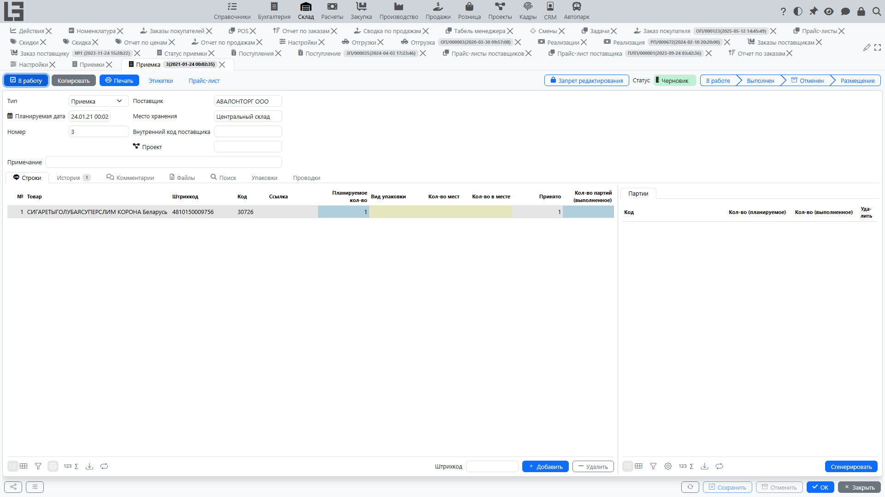

Приемка фиксирует факт приема товара в [место хранения](../inventory/locations.md) и помогает контролировать исполнение заказа: сколько уже принято и сколько осталось.

## Где находится

Обычно работа с приемками доступна:

- из карточки **[заказа поставщику](orders.md)** — в блоке связанных документов;
- в разделе [складского контура](../inventory/inventory.md) (если он используется) — зависит от конфигурации.

## Связь с заказом поставщику

Приемка может формироваться на основании подтверждённого заказа. В этом случае:

- реквизиты приемки ([поставщик](../masterdata/partners.md), [место хранения](../inventory/locations.md), планируемая дата) обычно подставляются из заказа;
- строки приемки формируются по строкам заказа;
- по этой связи система считает, сколько уже принято и сколько осталось принять;
- строки приемки, связанные с заказом, получают складскую себестоимость из цены строки заказа (так оценивается принятый товар).

Практический смысл: один заказ можно принимать **несколькими приемками** и **частями**.

## Когда появляется приемка по заказу

Как правило, приемки используются, когда включён [складской контур](../inventory/inventory.md).

Обычно приемка становится доступной после того, как:

1. Заказ переведён в статус **«Подтвержден»**.
2. В заказе указано **[место хранения](../inventory/locations.md)**.
3. Для типа заказа настроено использование приемок (если в вашей конфигурации это требуется).

Если по заказу ещё есть «что принимать», система может создать (или подобрать ранее созданную) приемку, готовую к работе.

### Резервная приемка (автоподдерживаемая)

При подтверждении заказа (и при последующих изменениях) система автоматически:

1. Проверяет, есть ли по строкам заказа остаток к приемке (заказано минус принято).
2. Ищет связанную приемку в статусе **«В работе»** или создаёт новую с типом, указанным в типе заказа.
3. Синхронизирует у этой приемки шапку (поставщик, планируемая дата, место хранения) с заказом.
4. Добавляет/удаляет строки в соответствии с актуальным остатком; **«Планируемое кол-во»** по строке приемки фиксируется равным остатку к приемке.
5. Если в заказе не осталось строк с остатком — резервная приемка удаляется.

Эта приемка пересоздаётся/обновляется при изменении остатка к приемке по строкам, поставщика, планируемой даты, места хранения или номера заказа, а также при возврате заказа из «Закрыт» в «Подтвержден».

Если приемка превысит остаток по строке (попытка принять больше, чем заказано), система выдаст сообщение «По товару приемка превышает количество в заказе» и не сохранит документ.

Примечание: приемки обычно формируются **по позициям [номенклатуры](../masterdata/items.md)**. Если в заказе есть услуги, для них приемка, как правило, не требуется.

## Как оформить приемку на основании заказа

1. Откройте [заказ поставщику](orders.md).
2. В блоке связанных документов откройте нужную **приемку** (или создайте новую, если это предусмотрено в вашей конфигурации).
3. Проверьте реквизиты приемки:
   - поставщик;
   - планируемая дата;
   - [место хранения](../inventory/locations.md).
4. Перейдите к строкам приемки и укажите фактически принятое количество.
5. Сохраните/подтвердите приемку согласно правилам вашей конфигурации.

Важно: приемка фиксирует **факт приема в [место хранения](../inventory/locations.md)** и используется для контроля исполнения заказа «сколько уже принято».

## Частичная поставка и несколько приемок

Если поставка приходит частями, оформляйте приемки по мере поступления товара:

- можно создавать несколько приемок по одному заказу;
- по строкам заказа система обычно показывает остаток к приемке (сколько ещё нужно принять);
- при следующей приемке заполняйте только фактически поступившее количество.

Обычно система не позволяет принять больше, чем заказано (с учётом уже оформленных приемок). Если возникает необходимость принять больше (перепоставка) — это поведение зависит от правил вашей конфигурации.

Если вы меняете заказ после подтверждения (количество, место хранения, планируемую дату и т.п.), система может обновить резервную приемку и её строки. Поэтому перед фактическим приемом проверяйте, что приемка соответствует актуальному заказу.

## Контроль исполнения по строкам

В карточке заказа, как правило, доступны показатели по строкам:

- **«Принято»** — сколько уже принято по строке;
- визуальная подсветка, если принято не полностью;
- список приемок, связанных со строкой (по клику/открытию).

В списке заказов отображаются агрегированные колонки **«Статус приемки»** и **«Статус поступления»** — статусы документов, связанных с каждым заказом, а быстрый фильтр **«Создать поступление»** отбирает заказы, ожидающие оформления.

## Ограничения при закрытии/фиксации заказа

В [типе заказа](settings.md) есть два независимых флага, влияющих на действие **«Закрыть»**:

- **«Запрещено закрытие заказов с действующими приемками»** — система не даст закрыть заказ, пока у него есть резервная приемка в статусе «В работе». Если флаг выключен, такая приемка просто удаляется при закрытии.
- **«Запретить закрытие заказов, которые не полностью приняты»** — система не даст закрыть заказ, пока есть остаток к приемке (есть строки, которые ещё не приняты полностью).

При нарушении любого из этих правил выводится соответствующее сообщение, и заказ остаётся в статусе «Подтвержден».

См. также: [Приемки](../inventory/receipts.md), [Настройки](settings.md).