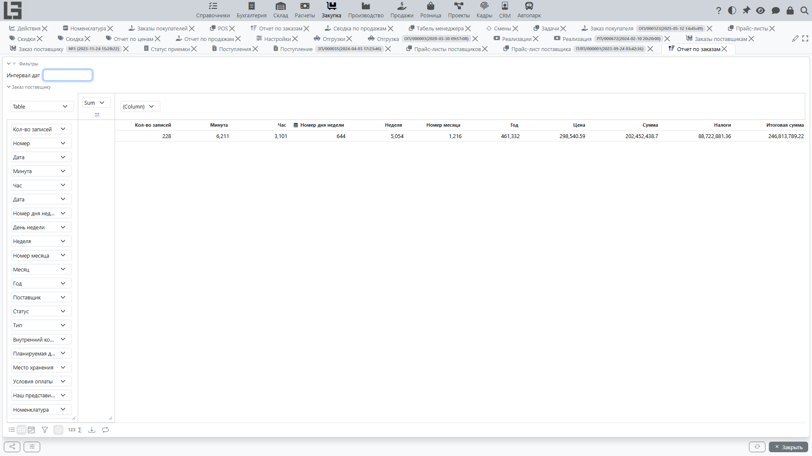

## Где находится

Отчётность по закупкам состоит из одного отчёта — **«Отчет по заказам»**, который находится в разделе **«Закупка» → «Отчетность» → «Отчет по заказам»**.

## Отчет по заказам

Отчёт позволяет анализировать заказы в разрезе:

- [поставщиков](../masterdata/partners.md);
- статусов;
- дат;
- [номенклатуры](../masterdata/items.md) и категорий (если используется классификация);
- колонок атрибутов номенклатуры (см. [номенклатура](../masterdata/items.md));
- реквизитов заказа (тип, [условия оплаты](../invoicing/settings.md#условия-оплаты), «Планируемая дата», «Внутренний код поставщика», «Наш представитель» и др.).

В отчёте показываются только заказы по местам хранения, к которым у пользователя есть доступ (а также заказы без места хранения).

### Фильтры по датам и группировки

В отчёте доступны:

- фильтр по интервалу дат;
- готовые колонки дат в сводной таблице — день недели, неделя, месяц, год и др., — по которым можно группировать данные.

### Для чего использовать

Отчёт полезен для:

- контроля «что заказано» и «у кого заказано»;
- анализа плановых сроков поставки;
- подготовки сверок с поставщиками.