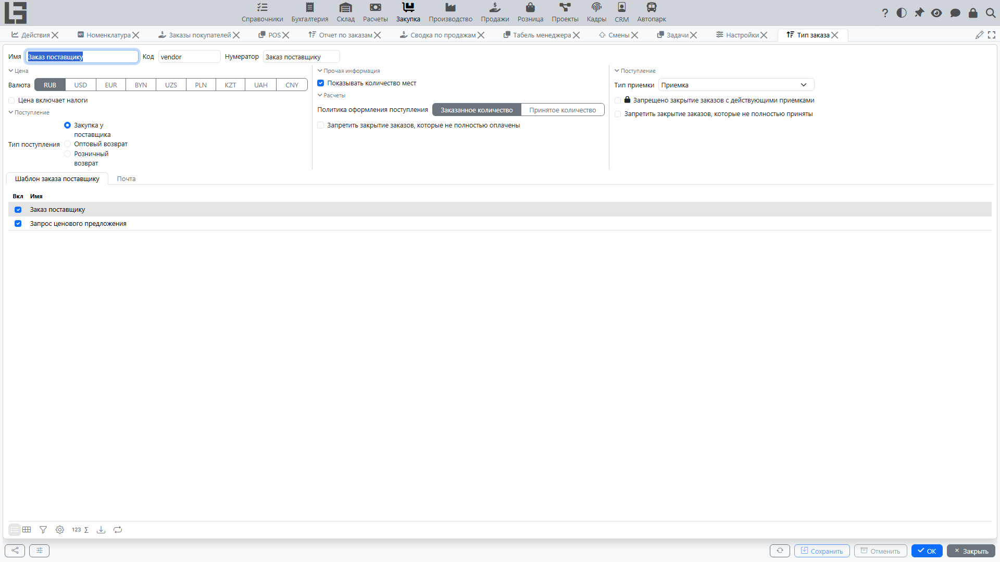

## Где находится

Настройки обычно находятся в разделе **«Закупка» → «Настройка» → «Настройки»**.

## Тип заказа поставщику

Большая часть поведения закупок настраивается в **типе заказа поставщику**. Для каждого типа можно задать:

### Базовые поля

- **нумератор** — формат и счётчик номеров заказов;
- **валюта по умолчанию** и признак «цена включает налоги»;
- флаг **«Показывать количество мест»** — добавляет в строки заказа колонки упаковочных единиц (см. [Кол-во мест](../inventory/product-sku.md#альтернатива-учет-в-упаковках-местах-в-документах)).

Место хранения и условия оплаты в типе заказа не задаются: место хранения указывается в каждом заказе, а условия оплаты по умолчанию берутся из карточки поставщика.

### Связи с другими документами

- **тип приемки** — какой документ создаётся как резервная приемка при подтверждении заказа (см. [Приемки по заказам поставщикам](receipts.md));
- **тип поступления** — какой документ создаётся действием «Создать поступление» (см. [Поступления по заказам поставщикам](bills.md));
- **«Политика оформления поступления»** — «Заказанное количество» или «Принятое количество»; определяет, какое количество переносится в поступление.

Заказы поставщикам не создают производственные заказы; связь обратная — производственные потребности могут учитываться при автозаполнении заказа поставщику (см. [Автоматическое заполнение заказа](orders.md#автоматическое-заполнение-заказа)).

### Отправка заказа поставщику

Поля для действия **«Отправить»**:

- **«Шаблон по умолчанию»** — печатная форма заказа, прикладываемая к письму;
- **«Тема»** — тема письма;
- **тело письма**;
- **«Копия»** — адрес, получающий письмо скрытой копией (Bcc).

Действие **«Отправить»** всегда доступно в карточке заказа в статусе «Черновик». Если шаблон настроен, поставщику отправляется письмо с приложенной печатной формой; иначе действие просто переводит заказ в статус «Отправлен».

### Ограничения закрытия

Три независимых флага, влияющих на действие **«Закрыть»** (оно переводит заказ в статус «Закрыт»):

- **«Запрещено закрытие заказов с действующими приемками»** — не даст закрыть заказ с резервной приемкой в статусе «В работе»;
- **«Запретить закрытие заказов, которые не полностью приняты»** — не даст закрыть заказ, по которому ещё есть остаток к приёмке;
- **«Запретить закрытие заказов, которые не полностью оплачены»** — не даст закрыть заказ, по которому оплачено не всё количество.

Без этих флагов закрытие проходит без проверок (а резервная приемка просто удаляется).

## Тип импорта прайс-листа

Отдельно настраивается **тип импорта прайс-листа** со скриптом, который используется при действии «Импорт» в карточке прайс-листа поставщика. Подробнее: [Прайс-листы поставщиков → Импорт цен](pricelists.md#импорт-цен-из-внешнего-источника).

В блоке **«Типы импорта прайс-листа»** формы настроек колонка **«По умолчанию»** отмечает резервный тип импорта, используемый для поставщиков без собственного типа (см. [Тип импорта по умолчанию](pricelists.md#тип-импорта-по-умолчанию)). Кроме того, в карточке типа импорта есть вкладка **«Поставщики»**, где отмечаются поставщики, использующие этот тип.

## Прочие справочники, влияющие на работу закупок

- **[поставщики](../masterdata/partners.md)** — реквизиты, тип импорта прайс-листа, поле **«Период заказа»**, используемое при автозаказе;
- **[номенклатура](../masterdata/items.md)** и **закупочные упаковки** — используются при автозаказе для округления количеств;
- **[налоги](../invoicing/taxes.md)** и **[валюты](../masterdata/currencies.md)** — общие справочники.