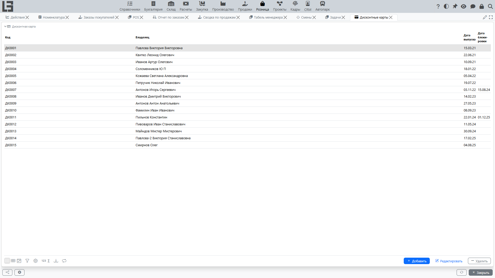

Дисконтная карта идентифицирует покупателя на [кассе](pos.md): когда карта вводится в чек, покупатель чека подставляется из владельца карты. Собственного процента скидки карта не несёт — скидка определяется [правилами скидок](../sales/discounts.md), которые действуют для связанного покупателя.

## Где находится

**«Розница» → «Настройка» → «Дисконтные карты»**.

## Основные данные карты

У дисконтной карты есть:

- **код** — идентификатор карты; именно он сканируется на кассе;
- **владелец** — покупатель, которому принадлежит карта;
- **дата выпуска**;
- **дата блокировки** — указывается при блокировке карты.

## Выпуск карты

Карту можно создать:

- в списке **«Дисконтные карты»** — создать карту и указать её владельца;
- из карточки покупателя — на вкладке **«Дисконтные карты»** контрагента, где новая карта создаётся уже привязанной к этому покупателю.

Код карты присваивается автоматически нумератором.

## Блокировка карты

Карта блокируется указанием **даты блокировки**. Дата блокировки не может быть раньше даты выпуска.

Блокировка действует начиная с даты блокировки: карта отклоняется только в чеке или реализации с датой **не раньше** этой даты. Если дата блокировки в будущем, до её наступления карта остаётся рабочей.

Заблокированную карту использовать нельзя: на кассе система выдаёт сообщение **«Дисконтная карта заблокирована»** и не привязывает её к чеку; в реализации карта не проходит проверку.

## Использование карты

- **На кассе** — введите или отсканируйте код карты в поле штрихкода. Владелец карты становится покупателем чека (см. [Касса и POS](pos.md)).
- **В реализации** — на стандартной форме [реализации](../invoicing/invoices.md) карта напрямую не выбирается; поле карты выведено на экране POS. Если чек (реализация) всё же несёт карту, система подставляет покупателя из карты и проверяет, что карта соответствует покупателю и не заблокирована.
