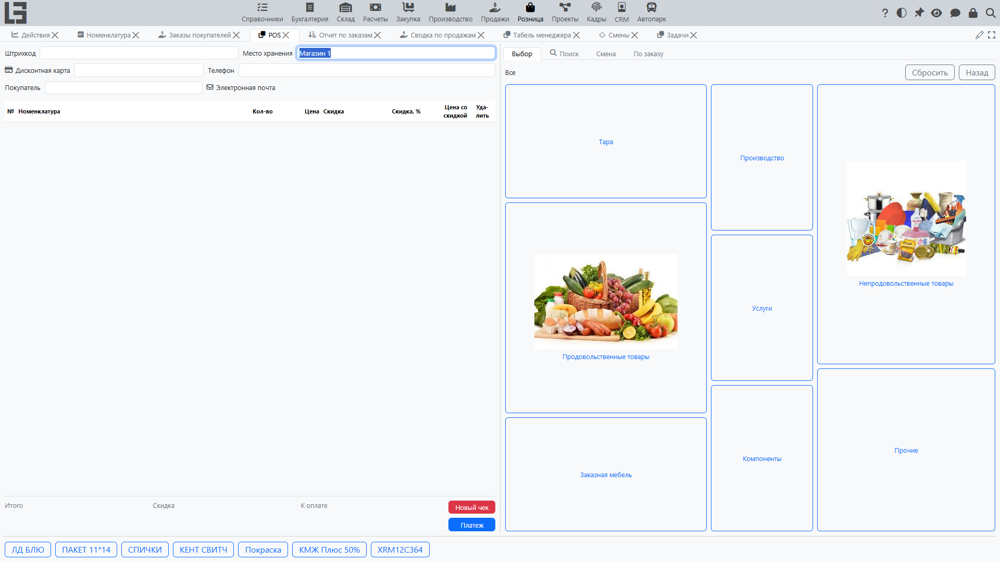
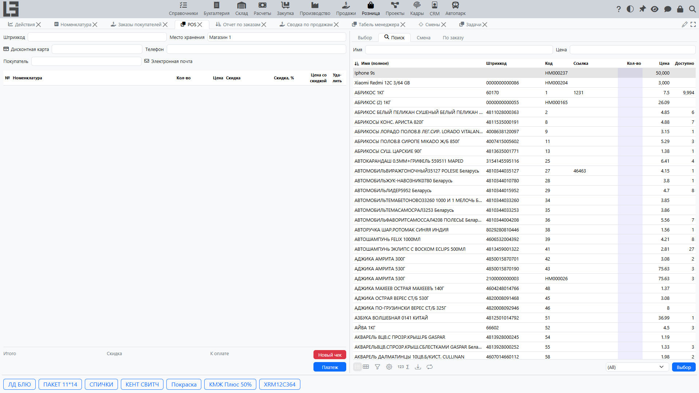
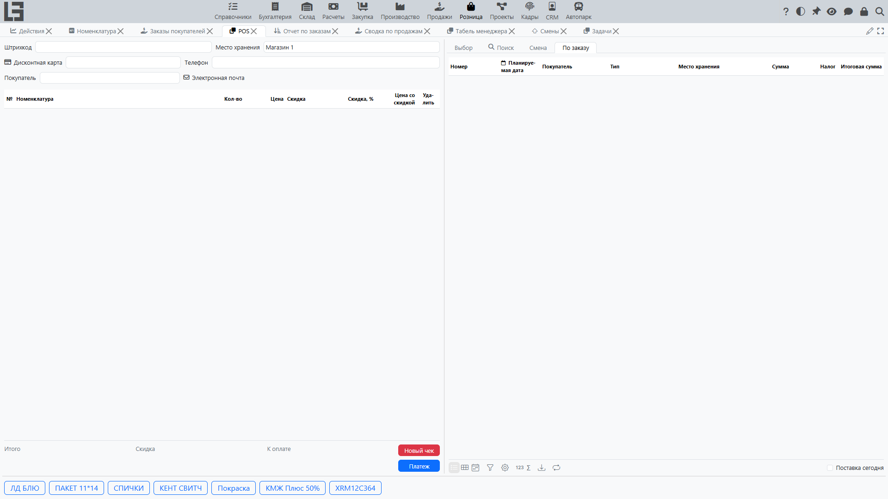
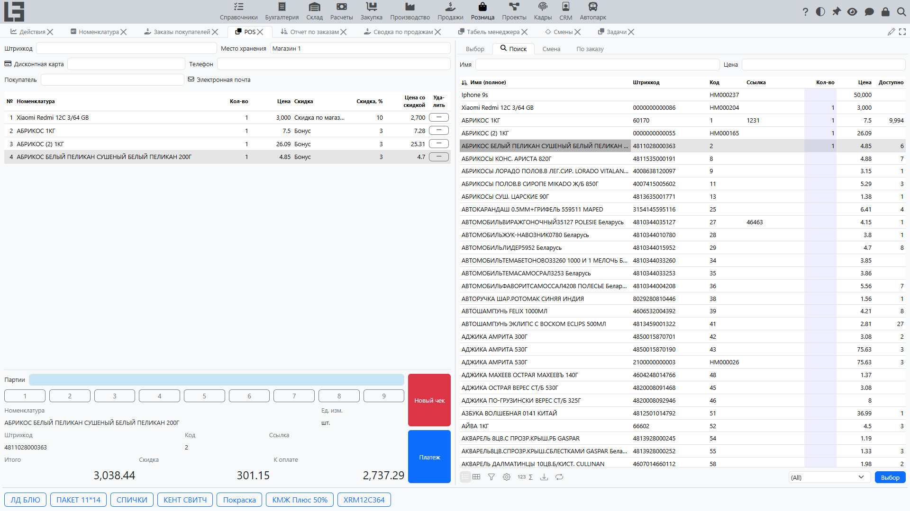
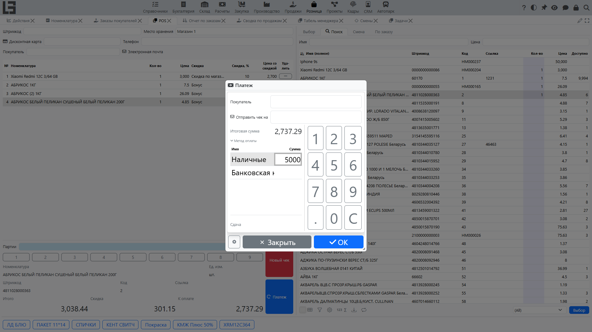
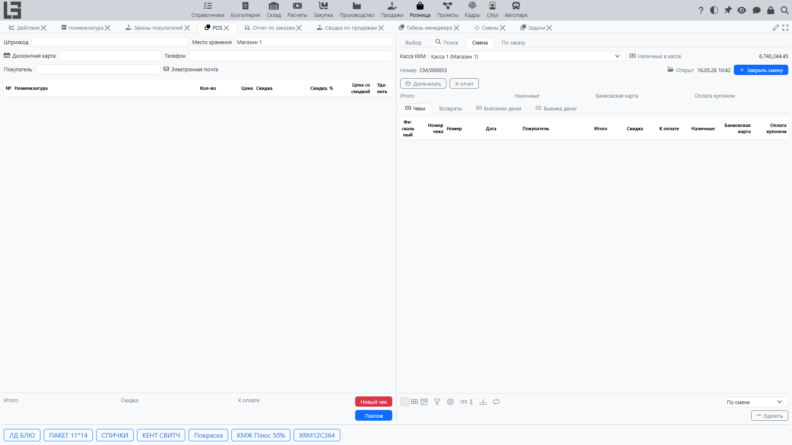

Экран **POS** (рабочий стол кассира) — это место, где кассир оформляет продажи и возвраты: открывает и закрывает [смену](sessions.md), формирует чек, ищет и сканирует товары, применяет скидки и [дисконтные карты](discount-cards.md), принимает оплату, вносит и изымает наличные.

## Где находится

- **POS** — **«Розница» → «Операции» → «POS»**.
- Список **смен** — **«Розница» → «Операции» → «Смены»**.
- **Кассы** (рабочие места кассиров) настраиваются в **«Розница» → «Настройка» → «Кассы»** (см. [Настройки](settings.md)).

## Структура экрана

Экран POS состоит из двух панелей:

- **левая панель** — текущий чек: его шапка (поле штрихкода и покупатель), список строк чека, сведения о позиции и итоги, цифровая клавиатура и кнопки действий;
- **правая панель** — набор вкладок: **«Выбор»**, **«Поиск»**, **«По заказу»** и **«Смена»**.

Над панелями расположен ряд **кнопок быстрого доступа** для часто продаваемых товаров (см. *Кнопки быстрого доступа* ниже).

## Выбор кассы и смены

На вкладке **«Смена»** выберите **кассу**. Если текущий компьютер привязан к кассе, она подставляется автоматически; иначе доступны все кассы.

Чтобы начать работу, откройте **[смену](sessions.md)**:

- нажмите **«Открыть смену»** на вкладке «Смена» — кнопка показывается, только пока смена не открыта;
- появляются дата и время открытия и номер смены, область чека становится доступной.

> Если по кассе уже открыта смена, система выдаёт сообщение **«Уже есть открытая смена»** и не открывает вторую.

Чтобы завершить работу, нажмите **«Закрыть смену»** и подтвердите.

Поле **«Наличные в кассе»** в шапке показывает текущий остаток наличных по открытой смене.

## Формирование чека

Чек — это документ продажи, создаваемый внутри смены. Новый пустой чек создаётся автоматически при открытии смены и после каждой завершённой оплаты.

### Добавление товаров

Товары можно добавить несколькими способами:

- **Штрихкод** — введите или отсканируйте код в поле штрихкода в верхней части чека. Система распознаёт штрихкод товара, [код маркировки](marking.md) или [дисконтную карту](discount-cards.md). Нераспознанный код вызывает сообщение **«Штрихкод не найден»**.
- **Вкладка «Поиск»** — найдите товар по **наименованию** (`F6`) или по **цене** (`F7`), затем дважды щёлкните по нему или укажите количество, чтобы добавить его в чек. Фильтр **«В документе»** (`Shift+F10`) показывает только товары, уже добавленные в чек; фильтр **«Активно»** ограничивает список активными товарами.
- **Вкладка «Выбор»** — плиточная витрина категорий и товаров с изображениями. Нажмите на категорию, чтобы перейти вглубь, нажмите на товар, чтобы добавить его; для навигации используйте **«Назад»** и **«Сбросить»**. Категории и товары можно скрыть из этой витрины на вкладке **«Выбор»** формы настроек.
- **Кнопки быстрого доступа** — товары, у которых в карточке задана *горячая клавиша (имя)*, отображаются на экране POS как кнопки быстрого добавления.

### Изменение строки

- **Количество** — измените его прямо в строке или с помощью экранной **цифровой клавиатуры**. Ввод `0` удаляет строку.
- Строку также можно удалить действием удаления в таблице строк.
- Для выбранной строки под списком показываются сведения о товаре (наименование, единица измерения, штрихкод, код, артикул).

### Итоги чека

Внизу чека показываются **«Сумма»**, **«Скидка»** и **«К оплате»**.

### Новый чек

**«Новый чек»** (`Shift+F12`) отменяет текущий незавершённый чек — после запроса подтверждения — и начинает новый чек в той же смене.

## Покупатель и дисконтная карта

Покупателя можно указать в чеке:

- введите или отсканируйте **[дисконтную карту](discount-cards.md)** — владелец карты становится покупателем чека;
- или укажите **покупателя** напрямую (`F5`).

Также можно ввести телефон и e-mail покупателя. Покупатель переносится в завершённую продажу и в оплату.

## Скидки

В каждой строке чека есть выбор **скидки** и колонки **«Скидка»** / **«Цена со скидкой»**. Скидку можно выбрать для строки вручную, а автоматические скидки рассчитываются по правилам модуля [Скидки в продажах](../sales/discounts.md) (по товару, покупателю, количеству и т. д.).

## Продажа по заказу

Вкладка **«По заказу»** показывает подтверждённые [заказы покупателя](../sales/orders.md) для покупателя текущего чека. Фильтр **«Доставка сегодня»** ограничивает список заказами с плановой датой на текущий день. Действие **«Добавить в чек»** переносит строки заказа в текущий чек.

## Маркированные товары и партии

Если товар учитывается по партиям, коды его партий сканируются в чек, и система контролирует отсканированное количество относительно количества в строке. Порядок работы с маркированными товарами (используется в российской конфигурации) описан в разделе [Маркированные товары](marking.md).

## Приём оплаты

Нажмите **«Оплата»** (`Ctrl+Enter`) — кнопка становится активной, как только у чека появляется сумма. В диалоге оплаты:

- укажите принятую сумму по одному или нескольким **[способам оплаты](payments.md)** (допускается дробление оплаты);
- для наличных **сдача** рассчитывается автоматически;
- оплату нельзя подтвердить, если безналичный способ (например, банковская карта) превышает сумму **«К оплате»**.

После подтверждения система фиксирует платежи, завершает чек и автоматически открывает следующий пустой чек. Подробнее см. [Оплата в рознице](payments.md).

## Пример: продажа от товаров до расчёта

Ниже показан полный проход продажи на кассе.

### Шаг 1. Откройте смену

Откройте экран **POS**, на вкладке **«Смена»** выберите кассу и нажмите **«Открыть смену»**. Система создаёт пустой чек — можно начинать продажу.

### Шаг 2. Добавьте товары в чек

Добавьте позиции любым удобным способом:

- отсканируйте штрихкод товара в поле штрихкода;
- или на вкладке **«Поиск»** найдите товар по наименованию либо цене и дважды щёлкните по нему;
- или выберите товар на вкладке **«Выбор»** либо кнопкой быстрого доступа.

Каждый добавленный товар появляется строкой чека с количеством, ценой и (если применимо) скидкой. Чтобы добавить тот же товар ещё раз, отсканируйте его повторно или измените количество в строке.

### Шаг 3. Проверьте количества и скидки

- Уточните **количество** в строках — прямо в строке или экранной цифровой клавиатурой; ввод `0` удаляет строку.
- При необходимости укажите **покупателя** или отсканируйте **дисконтную карту** — это может изменить применяемые скидки.
- Контролируйте итоги внизу чека: **«Сумма»**, **«Скидка»** и **«К оплате»**.

### Шаг 4. Перейдите к оплате

Нажмите **«Платеж»** (`Ctrl+Enter`) — кнопка активна, когда у чека есть сумма. Откроется диалог оплаты с суммой **«К оплате»**.

### Шаг 5. Рассчитайтесь с покупателем

В диалоге оплаты:

- введите принятую сумму по нужному **способу оплаты** (например, «Наличные») — сумму можно набрать на экранной клавиатуре;
- при необходимости разнесите оплату на несколько способов (например, часть наличными, часть картой);
- для наличных система рассчитает и покажет **«Сдача»** — сумму, которую нужно выдать покупателю.

Подтвердить оплату нельзя, если введённой суммы не хватает или безналичный способ превышает сумму к оплате.

### Шаг 6. Завершите чек

Нажмите **«ОК»**. Система:

- фиксирует платежи и завершает чек — продажа становится записанной;
- при подключённом фискальном устройстве печатает чек;
- автоматически открывает следующий пустой чек для новой продажи.

Завершённый чек попадает в список **«Чеки продаж»** на вкладке **«Смена»** и в итоги смены.

## Операции с наличными

Из шапки POS можно:

- **«Внести наличные»** — зарегистрировать внесение наличных в кассу;
- **«Изъять»** — зарегистрировать изъятие наличных.

Оба действия открывают диалог с цифровой клавиатурой для ввода суммы и регистрируются по открытой смене. Они показываются на вкладке **«Смена»** в списках **«Внесение наличных»** и **«Изъятие наличных»**.

## Фискальная регистрация

Если к кассе подключено фискальное устройство, открытие и закрытие смены, продажи, возвраты и операции с наличными регистрируются на нём, а экран POS предоставляет соответствующие фискальные команды (например, печать X-отчёта). Фискальная регистрация зависит от конфигурации и региона.

## Возвраты

Возврат оформляется с вкладки **«Смена»**: выберите исходный чек продажи в списке **«Чеки продаж»** и нажмите **«Возврат»**. Список можно фильтровать **«По смене»** или **«По кассе»**.

Полный порядок — корректировка строк возврата, оплата возврата и правила выдачи средств по способам оплаты — описан в разделе [Возвраты](returns.md).

## Итоги смены

Вкладка **«Смена»** показывает номер смены, время открытия и итоги, включая сумму, принятую каждым способом оплаты. Списки **«Чеки продаж»** и **«Возвраты»** показывают продажи и возвраты, выполненные в смене.

