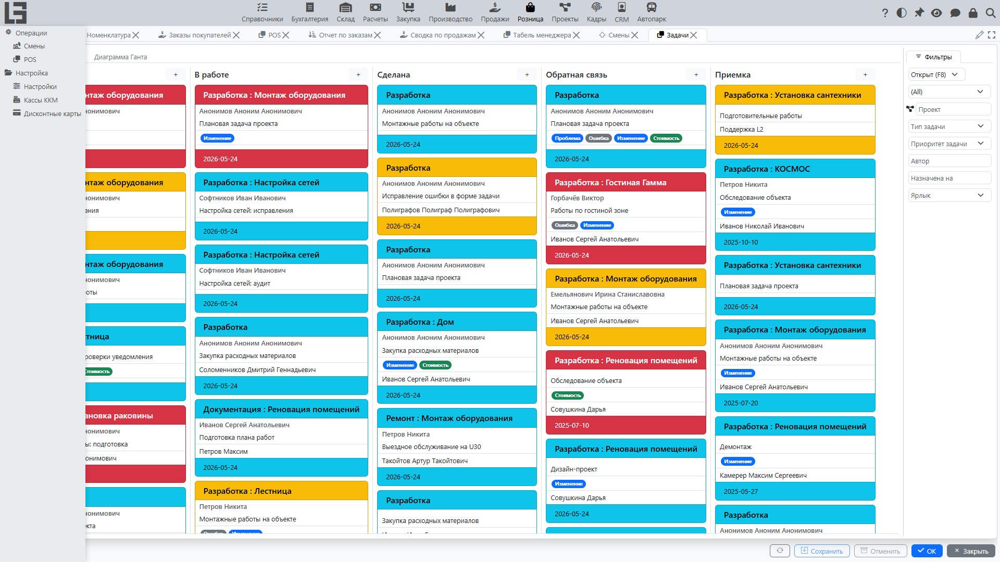

Документация описывает работу раздела **«Розница»**: настройку **[касс](settings.md)**, ведение **[смен](sessions.md)**, оформление продаж и возвратов через **[POS](pos.md)**, применение **[скидок](../sales/discounts.md)** и **[дисконтных карт](discount-cards.md)**, а также приём **[оплаты](payments.md)**.

Если в вашей конфигурации часть пунктов меню или действий отсутствует — это нормально: набор возможностей зависит от включённых модулей и настроек.

## Для кого этот раздел

Раздел **«Розница»** обычно используют:

- **Кассир** — оформляет продажи и возвраты, принимает оплату, печатает/отправляет чек покупателю.
- **Старший кассир / администратор** — открывает и закрывает смены, контролирует операции по кассе.
- **Администратор системы / ответственный за настройки** — настраивает кассы, методы оплаты, дисконтные карты и параметры работы POS.

## Содержание

- [Быстрый старт](#быстрый-старт)
- [Навигация](#навигация)
- [Термины](#термины)

Разделы:

- [Касса и POS](pos.md)
- [Возвраты](returns.md)
- [Смены](sessions.md)
- [Оплата в рознице](payments.md)
- [Дисконтные карты](discount-cards.md)
- [Маркированные товары (контрольные марки)](marking.md)
- [Настройки](settings.md)

## Быстрый старт

### Сценарий: открыть смену → пробить продажу → принять оплату → закрыть смену

1. В разделе **«Розница» → «Настройка»** убедитесь, что:
   - заведены **кассы** и (при необходимости) они привязаны к компьютерам — в справочнике **«Кассы ККМ»**;
   - настроены **методы оплаты** — на форме **«Настройки»**.
2. Откройте **«Розница» → «Операции» → «POS»**.
3. Выберите кассу и откройте смену действием **«Открыть смену»**.
4. Добавьте товары в чек (поиск / сканирование штрихкода / сенсорная витрина), при необходимости примените скидку или дисконтную карту.
5. Перейдите к оплате, укажите суммы по методам оплаты и подтвердите.
6. После завершения работы выполните **«Закрыть смену»**.

### Сценарий: оформить возврат покупателю

Возврат на кассе оформляется по исходному чеку продажи:

1. Откройте POS.
2. На вкладке **«Смена»** в списке **«Чеки»** найдите исходный чек и нажмите **«Возврат»**.
3. Уточните возвращаемые позиции и количества.
4. Выполните оплату возврата (выдачу средств): по каждому методу оплаты можно вернуть не больше, чем им было оплачено в исходном чеке, а сумма выдачи должна равняться сумме возврата.

Подробности: [Возвраты](returns.md).

## Навигация

Раздел **«Розница»** содержит две группы:

- **Операции** — экран кассира **POS** и список **смен**.
- **Настройка** — форма **«Настройки»** и справочники **«Кассы ККМ»** и **«Дисконтные карты»**.

Типовые пункты:

- **«Розница» → «Операции» → «POS»** — экран кассира для продаж и возвратов.
- **«Розница» → «Операции» → «Смены»** — список смен.
- **«Розница» → «Настройка» → «Настройки»** — параметры раздела.

## Термины

### Касса

**[Касса](settings.md)** — рабочее место для оформления продаж и возвратов. Как правило, касса связана с конкретным компьютером/устройством.

### Смена

**[Смена](sessions.md)** — период работы кассы между **открытием смены** и **закрытием смены**. Операции POS выполняются в рамках открытой смены.

### POS

**[POS](pos.md)** — экран кассира для оформления продаж и возвратов: создание чека, добавление товаров, применение скидок, переход к оплате.

### Чек

Результат оформления продажи или возврата (в **[POS](pos.md)**): список позиций, цены, скидки, сумма к оплате и метод(ы) оплаты.

### Метод оплаты

**[Метод оплаты](payments.md)** — правило, по которому принимаются деньги (например, наличные или банковская карта) и формируются связанные финансовые операции.

### Дисконтная карта

**[Дисконтная карта](discount-cards.md)** — карта, идентифицирующая покупателя в чеке; покупатель чека подставляется из владельца карты.