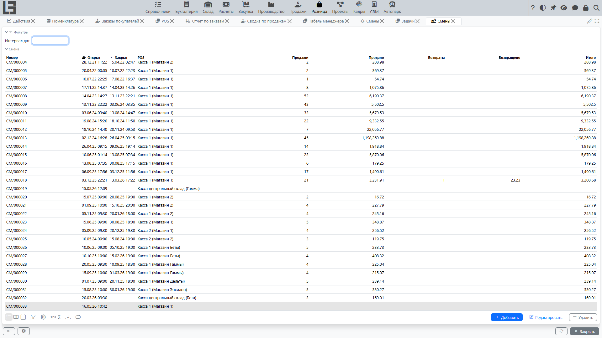

Смена — это период работы **[кассы](settings.md)** между открытием и закрытием. Продажи и возвраты в **[POS](pos.md)** выполняются в рамках открытой смены.

## Где находится

**«Розница» → «Операции» → «Смены»**.

## Как открыть смену

Смена открывается с экрана **[POS](pos.md)**, а не из списка смен:

1. Откройте **«Розница» → «Операции» → «POS»**.
2. На вкладке **«Смена»** выберите **[кассу](settings.md)**.
3. Нажмите **«Открыть смену»**.

Система фиксирует дату и время открытия и присваивает номер смены.

### Ограничения

- Нельзя открыть смену, если по кассе уже есть открытая смена — система выдаёт сообщение **«Уже есть открытая смена»**.

## Как закрыть смену

На экране **POS** нажмите **«Закрыть смену»** на вкладке «Смена» и подтвердите.

Система фиксирует дату и время закрытия.

## Что показывает смена

Смена сводит операции, выполненные по кассе за время её работы:

- **«Продажи»** — количество продаж;
- **«Продано»** — сумму продаж;
- **«Возвраты»** — количество возвратов;
- **«Возвращено»** — сумму возвратов;
- **«Итого»** — продажи за вычетом возвратов;
- сумму, принятую каждым **[методом оплаты](payments.md)**;
- списки **«Чеки»** и **«Возвраты»**;
- внесения и выемки денег и итоговый остаток наличных.

Отдельный список **«Розница» → «Операции» → «Смены»** используется для просмотра и анализа смен — колонки с количеством и суммами продаж и возвратов показываются именно в нём.

