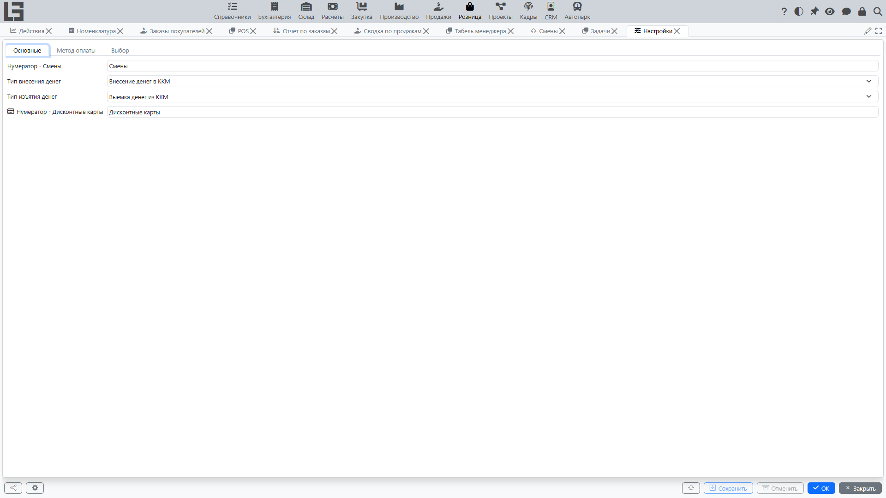
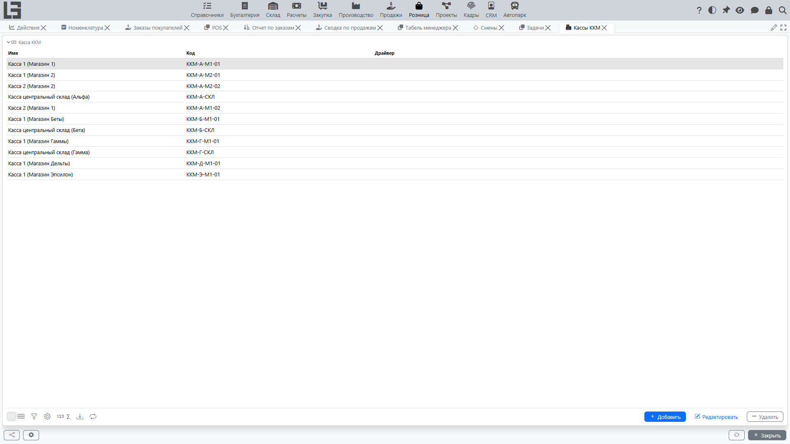

Страница описывает базовые настройки, влияющие на работу **[кассы](pos.md)** и **[POS](pos.md)**.

## Где находится

Настройки обычно находятся в разделе **«Розница» → «Настройка» → «Настройки»**.

В большинстве конфигураций основные справочники (кассы, способы оплаты, дисконтные карты) доступны прямо из этого раздела.

## Кассы

Касса — это рабочее место, с которого оформляются продажи и возвраты.

Где искать: обычно **«Розница» → «Настройка» → «Кассы»**.

Обычно настраиваются:

- **наименование** и **код** кассы;
- **организация**;
- привязка кассы к **компьютеру** (чтобы на конкретном компьютере предлагалась «своя» касса);
- **счета по способам оплаты** — на отдельной вкладке кассы для каждого **[способа оплаты](payments.md)** можно указать **счёт**, на который относятся принятые этим способом платежи.

> **Наличный счёт.** Чтобы на экране POS работали операции **«Внести наличные»** и **«Изъять»** (а в шапке отображался остаток в поле **«Наличных в кассе»**), для способа оплаты **«Наличные»** у кассы должен быть указан **счёт**. Пока наличный счёт не задан, кнопки внесения и изъятия наличных на экране POS остаются **недоступными** (неактивны). Кроме того, для самих операций внесения/изъятия в настройках должны быть заданы соответствующие **типы платежей** (тип внесения и тип изъятия).

## Смены

**[Смены](sessions.md)** нумеруются автоматически. Нумератор смен выбирается на вкладке **«Основные»** формы настроек.

## Способы оплаты

Список способов оплаты ведётся в форме настроек (см. также: **[Оплата в рознице](payments.md)**). Для каждого способа указываются:

- **наименование** и **код**;
- признак **«Наличные»** — отмечает способ как наличный (используется для расчёта сдачи);
- **тип входящего платежа** и **тип возвратного платежа** — типы платежей, которые используются при приёме способа в продаже и при выдаче средств в возврате.

## Дисконтные карты

**[Дисконтные карты](discount-cards.md)** нумеруются автоматически; нумератор дисконтных карт выбирается на вкладке **«Основные»** формы настроек. Сам список карт находится в **«Розница» → «Настройка» → «Дисконтные карты»**.

## Маркированные товары

Если в вашей конфигурации используется работа с **[маркированными товарами](marking.md)**:

- в настройках интеграции **Честный Знак** должны быть заполнены токен и (при необходимости) параметры Sandbox;
- для оффлайн-сценария должен быть настроен локальный модуль ЧЗ (ЛМ ЧЗ) и выполнена его инициализация;
- по категориям может задаваться обязательность сканирования;
- может настраиваться режим проверки кодов (онлайн/оффлайн);
- для оффлайн-проверки может потребоваться указать локальный модуль для кассы.

Подробный пользовательский порядок: [CRPT (Честный Знак) и маркированные товары](marking.md).