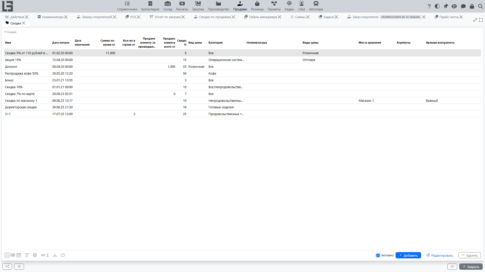
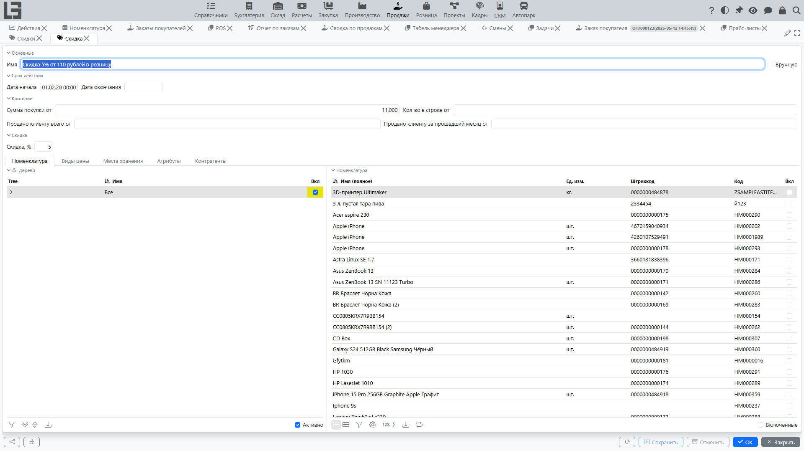

В системе скидка — это отдельный объект **«Скидка»**, который может применяться к строкам документов продаж (в первую очередь — к строкам [заказа покупателя](orders.md)).

Скидка может задаваться:

- как **процент скидки**;
- как **цена из вида цены** (то есть «фиксировать цену по другому виду цены»).

## Где настраиваются скидки

Обычно список скидок находится в разделе **«Продажи» → «Операции» → «Скидки»**.

По умолчанию в списке включён фильтр **«Активно»**, показывающий только действующие сейчас скидки; его можно отключить, чтобы увидеть все скидки.

В карточке скидки задаются:

- период действия;
- условия применимости;
- к какой [номенклатуре](../masterdata/items.md)/категориям относится;
- какие [виды цены](pricelists.md) разрешены;
- при необходимости — к каким [местам хранения](../inventory/locations.md) относится;
- размер скидки (процент) или вид цены (если скидка задаётся ценой).

## Как система понимает, подходит ли скидка строке

Для строки заказа покупателя система проверяет скидку по набору условий.

### 1) По товарам и категориям

Скидка может быть привязана:

- к конкретным товарам;
- к категориям товаров (иерархия категорий).

Если в скидке не выбраны ни категории, ни товары, скидка считается настроенной неверно и система не даст её сохранить.

### 2) По периоду действия

Скидка применяется, только если дата/время строки попадает в интервал действия скидки — не раньше даты/времени начала и не позже даты/времени окончания.

### 3) По виду цены

Скидка может быть ограничена видами цены:

- если у скидки указаны виды цены, она применяется только к строкам с одним из этих видов;
- если виды цены не указаны, ограничение не действует.

### 4) По месту хранения

Скидку можно ограничить местами хранения:

- места хранения отмечаются в скидке флажком **«Вкл.»** с тремя состояниями: место можно включить или явно исключить; вложенные места хранения наследуют отметку ближайшего отмеченного родителя, а явная отметка исключения имеет приоритет над включением через родителя;
- если у скидки заданы места хранения, она применяется только к строкам с включённым местом хранения;
- если места хранения не заданы, ограничение не действует.

### 5) По минимальному количеству и сумме покупки

Скидка может требовать:

- минимального количества в строке — поле **«Кол-во в строке от»** сравнивается с количеством в строке;
- минимальной суммы покупки — поле **«Сумма покупки от»** сравнивается с общей суммой всего документа с учетом налогов (а не с суммой строки).

Если порог не достигнут, скидка не применяется.

Сумма для проверки — «полная» сумма документа: она рассчитывается из количеств и цен с учетом налогов (если цена не включает налог, он добавляется).

### 6) По накопительным условиям по покупателю

Скидка может быть накопительной и включаться только если у [покупателя](../masterdata/partners.md):

- общий объём предыдущих покупок не меньше порога (поле скидки **«Продано клиенту всего от»**);
- или объём покупок за прошлый календарный месяц не меньше порога (поле скидки **«Продано клиенту за прошедший месяц от»**).

Порог считается достигнутым, когда накопленное значение равно значению поля или больше него.

Значения, с которыми сравниваются пороги, накапливаются системой:

- **«Продано»** в карточке покупателя — сумма по всему регистру продаж (с учётом начального значения, заданного вручную);
- **«Продано за предыдущий месяц»** в карточке покупателя — сумма продаж за предыдущий календарный месяц.

При расчёте берётся значение на момент перед текущей сессией (т.е. покупки в той же сессии не сдвигают порог).

### 7) По ярлыкам контрагента

Скидку можно ограничить контрагентами с определёнными ярлыками (поле **«Ярлыки контрагента»**):

- если в скидке указаны ярлыки, она применяется только к контрагентам, у которых есть один из этих ярлыков;
- если ярлыки не указаны, ограничение не действует.

### 8) По атрибутам номенклатуры

Скидку можно ограничить значениями атрибутов номенклатуры:

- если в скидке указаны значения атрибутов, она применяется только к строкам, номенклатура которых соответствует этим значениям;
- если значения атрибутов не указаны, ограничение не действует.

> Скидки никогда не применяются к строкам возврата.

## Как считается цена по скидке

Для каждой подходящей скидки система вычисляет «цену по скидке».

### Вариант 1: скидка в процентах

Если в скидке задан процент, цена по скидке считается так:

`цена по скидке = исходная цена × (100 − процент скидки) / 100`

### Вариант 2: скидка через вид цены

Если в скидке задан вид цены, цена по скидке берётся из этого вида цены на дату строки.

Практический смысл:

- можно задать скидку как «продавать по оптовой цене» или «по цене из специального прайс‑листа».

## Как выбирается скидка автоматически

Если для строки подходит несколько скидок, система автоматически выбирает **наиболее выгодную для покупателя** из автоматических скидок.

Правило выбора:

- из всех подходящих автоматических скидок выбирается та, у которой **цена по скидке минимальная**.

Это соответствует логике выбора в коде: выбирается скидка с минимальной рассчитанной ценой.

Важно:

- скидки не суммируются;
- выбирается одна скидка, дающая минимальную цену (то есть «самую большую выгоду» в рамках заданных скидок).

## Ручной выбор скидки в строке

В строке заказа покупателя можно вручную выбрать скидку (поле «Скидка»).

Как это работает:

1. Пользователь открывает выбор скидки.
2. Система показывает только те скидки, которые подходят к строке по условиям.
3. Пользователь выбирает скидку.

В карточке скидки есть флаг **«Вручную»**: такие скидки исключаются из автоматического выбора и доступны только для ручного выбора в строке.

Если выбранная скидка процентная, система подставляет процент в строку (если пользователь не вводил процент вручную).

Если выбранная скидка задаётся видом цены, система подставляет цену по этому виду цены и пересчитывает скидку/сумму строки.

## Автоматический пересчёт скидок

Если включён автоматический пересчёт скидок, система пересчитывает скидку по строке при изменениях:

- дата документа/строки;
- контрагент;
- номенклатура;
- количество;
- цена;
- тип документа;
- место хранения;
- общая сумма документа.

Автоматический пересчёт выполняется только для скидок, которые не помечены как «вручную».

Также в заказе есть действие **«Рассчитать скидки»**, которое принудительно пересчитывает скидки по всем строкам (кроме ручных).

Скидки рассчитываются не только в заказах, но и в реализациях.

### Как отключить автопересчёт

В настройках есть параметр **«Не рассчитывать автоматически скидки в заказе»**.

Если он включён:

- автоматический пересчёт по изменениям не выполняется;
- пользователь применяет скидки вручную и/или через кнопку «Рассчитать скидки».

Для реализаций есть отдельная настройка **«Не рассчитывать автоматически скидки в реализации»**.

## Где отражаются скидки

Скидки обычно видны:

- в строках заказа (выбранная скидка, процент/цена);
- в документах реализации (если скидки переносятся в реализацию);
- в отчёте по продажам — колонка **«Сумма скидки»**;
- на рабочем месте кассира (сумма скидки по чеку).

Сумма скидки по документу на форме самого заказа не отображается.

## Типовые проблемы

- **Скидка не применяется** — проверьте дату, вид цены, место хранения, пороги количества/суммы и ограничения по товарам/категориям.
- **Подходят несколько скидок, но выбралась «не та»** — система выбирает скидку с минимальной ценой по скидке. Если нужно выбрать другую, используйте ручной выбор.
- **Скидка «слетает» после изменения строки** — включён автопересчёт и выбранная скидка не является ручной.

## Примеры

Ниже — несколько упрощённых примеров, чтобы было понятно, как работают правила.

### Пример 1. Процентная скидка с порогом по количеству

Условия скидки:

- товары: «Кабель» (или категория «Кабели»);
- период действия: текущий месяц;
- минимальное количество в строке: `10`;
- скидка: `5%`.

Ситуация в заказе:

- строка: «Кабель», количество `8`, цена `100`.

Результат:

- скидка **не применяется**, потому что количество меньше `10`.

Если изменить количество на `10`:

- цена по скидке = `100 × (100 − 5) / 100 = 95`;
- в строке будет применена цена `95` (или процент `5%`, в зависимости от того, как настроено отображение в вашей форме).

### Пример 2. Скидка через вид цены

Условия скидки:

- товары: категория «Бытовая техника»;
- скидка задаётся через вид цены: «Оптовая»;
- период действия: без ограничения.

Ситуация в заказе:

- строка: «Чайник», количество `1`;
- текущая цена в заказе (например, по базовому виду цены) — `3 000`;
- цена по виду цены «Оптовая» на дату заказа — `2 700`.

Результат:

- при применении этой скидки система подставит цену `2 700`.

Практический смысл: вместо расчёта «процента» вы фиксируете, что для этой группы товаров должны использоваться цены из другого вида цены.

### Пример 3. Подходят две скидки — выбирается наиболее выгодная покупателю

Пусть для строки подходят две автоматические скидки:

1. Скидка А: `10%`
2. Скидка Б: `5%`

Исходная цена в строке: `100`.

Цена по скидке:

- по скидке А: `100 × (100 − 10) / 100 = 90`;
- по скидке Б: `100 × (100 − 5) / 100 = 95`.

Автовыбор:

- система выберет скидку А, потому что цена по скидке `90` **ниже**, чем `95`.

Если по бизнес‑правилам нужно применить другую скидку (не самую выгодную), используйте ручной выбор скидки в строке.
