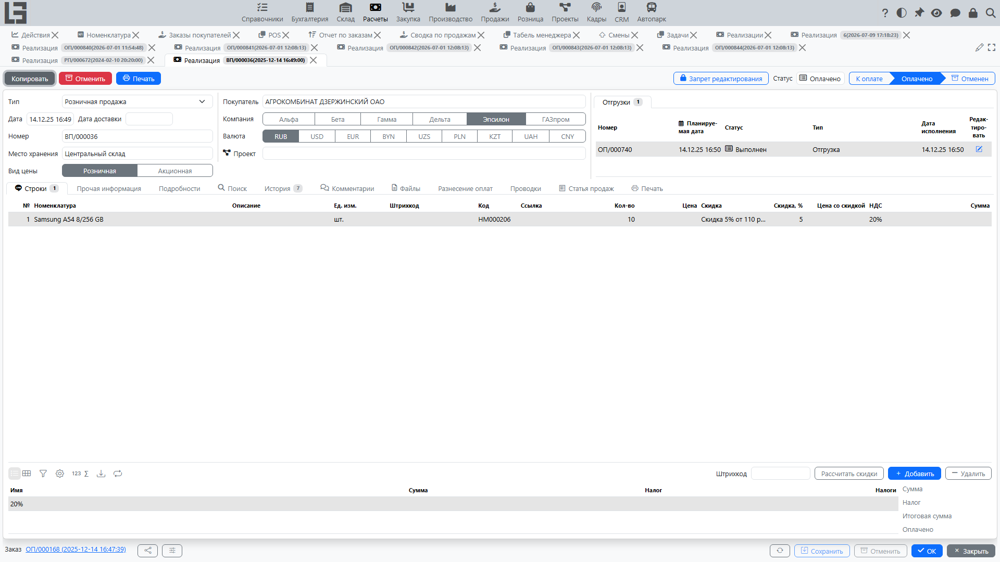

[Реализация](../invoicing/invoices.md) фиксирует продажу в учётном контуре: выручку, налоги и итоговые суммы.

## Где находится

Реализация создаётся из заказа покупателя: кнопка **«Создать реализацию»** появляется на подтверждённом заказе, когда остаётся количество к выставлению. Созданный документ — это [реализация модуля «Расчеты»](../invoicing/invoices.md); в карточке заказа отображается блок связанных **реализаций**.

Реализацию можно создать и из отгрузок: групповое действие **«Создать реализацию»** в списке отгрузок создаёт одну реализацию по выполненным количествам выбранных отгрузок.

## Связь с заказом

Реализация создаётся из заказа покупателя. Берутся ли её строки из заказанного количества или из фактически отгруженного, определяется настройкой **«Политика оформления реализации»** в типе заказа со значениями **«Заказанное количество»** или **«Отгруженное количество»** (см. [Настройки](settings.md)) — это не выбирается для каждого документа отдельно.

При создании в реализацию переносятся:

- [контрагент](../masterdata/partners.md) и подразделение;
- адрес доставки и **«Внутренний код покупателя»**;
- строки и количества (заказанные или отгруженные — согласно политике);
- цены, скидки и налоги;
- условия оплаты и примечание.

Реализация проходит статусы **«Черновик» → «К оплате» → «Оплачено»**; реализация, созданная из заказа, сразу получает статус **«К оплате»**.

В строках подтверждённого заказа отображаются колонки **«Реализовано»** и **«Оплачено»**.

## Типовой сценарий

1. Убедитесь, что заказ подтверждён и есть количество к выставлению.
2. Нажмите **«Создать реализацию»** на заказе — реализация сразу создаётся в статусе **«К оплате»**.
3. Проверьте суммы и налоги.
4. После оплаты реализация получает статус **«Оплачено»**.