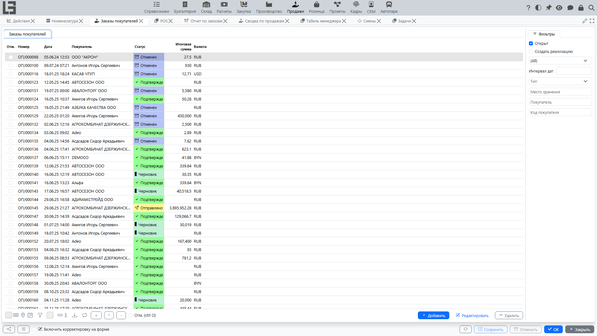
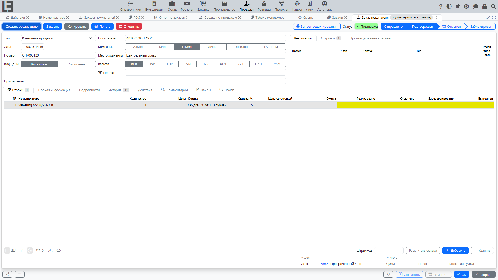

## Где находится

Откройте **«Продажи» → «Операции» → «Заказы покупателей»**.

## Назначение

Заказ покупателя фиксирует:

- [покупателя](../masterdata/partners.md) и условия продажи;
- состав заказа (строки);
- цены, скидки и налоги;
- планируемую дату (плановую дату отгрузки);
- связь с отгрузками, реализациями, производственными и закупочными заказами (если такие сценарии включены).

## Список заказов

В списке обычно доступны:

- номер и дата;
- [покупатель](../masterdata/partners.md);
- статус;
- сумма;
- планируемая дата;
- [место хранения](../inventory/locations.md).

По умолчанию включён фильтр **«Открыт»** — он скрывает закрытые заказы.

Фильтры и набор колонок зависят от конфигурации.

## Карточка заказа

### Основные поля

Как правило, в карточке указываются:

- **[Покупатель](../masterdata/partners.md)**;
- **Дата** и **Планируемая дата**;
- **[Место хранения](../inventory/locations.md)**;
- **Адрес доставки** (если используется);
- **Тип** — тип заказа; поле обязательно и заполняется автоматически, если в системе только один тип;
- **Наш представитель** — сотрудник компании, ответственный за заказ; по умолчанию подставляется текущий пользователь, если он связан с сотрудником.

Действие **«Копировать»** в карточке создаёт копию заказа. В нижней части карточки отображаются **«Долг»** и **«Просроченный долг»** покупателя; клик по значению открывает расшифровку долга.

### Строки заказа

В строках задаются:

- [номенклатура](../masterdata/items.md);
- количество;
- цена;
- скидка (если используется);
- сумма строки.

Рекомендация: сначала заполните покупателя и место хранения, затем добавляйте строки — так корректнее подбираются цены и доступность.

## Подтверждение и отмена

Заказ проходит статусы **«Черновик» → «Отправлен» → «Подтвержден» → «Закрыт»** и может быть **отменён** из любого статуса, кроме «Черновика» и уже отменённого.

Подробно про статусы, переходы и ограничения см. [Процесс и статусы заказа](workflow-and-statuses.md).

## Связанные документы

В карточке заказа связанные документы отображаются отдельными вкладками:

- [отгрузки](shipments.md);
- [реализации](invoices.md);
- производственные заказы.

Закупочные заказы показываются не вкладкой, а ссылкой **«Заказы поставщикам»** в нижней части карточки.

Наличие вкладок зависит от включённых модулей.