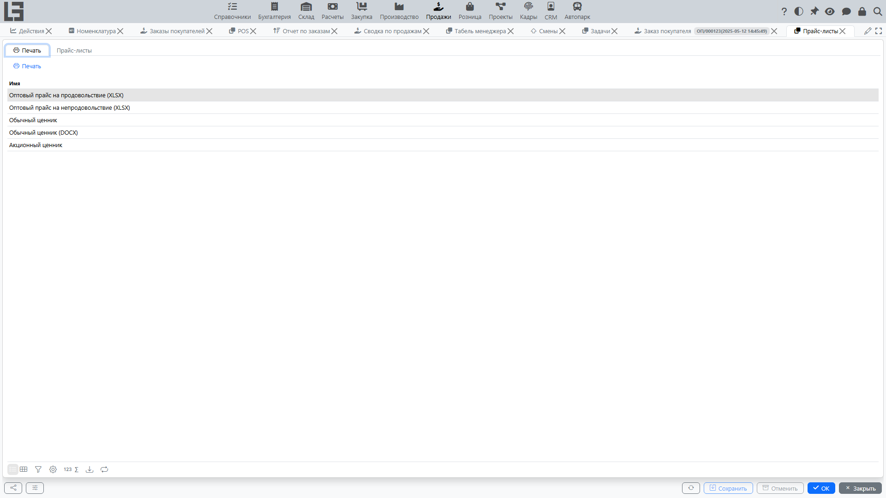

Прайс-листы используются для хранения и применения цен в заказах покупателя.

## Типы цен

Тип цены задаёт, как формируется цена:

- фиксированная цена;
- цена с наценкой;
- другие правила (в зависимости от конфигурации).

## Прайс-лист

Прайс-лист обычно содержит:

- тип цены;
- период действия;
- список номенклатуры и цен.

## Статусы прайс-листа

Прайс-лист обычно проходит два статуса:

1. **Черновик** — значения цен можно изменять; прайс-лист пока не используется в подстановках цен.
2. **Готов** — прайс-лист принят в работу; значения становятся источником цен на свою дату действия.

Перевод в статус «Готов» выполняется действием **«Отметить как готовый»** в карточке прайс-листа. Возврат в «Черновик» из «Готов» можно настроить отдельно (зависит от конфигурации).

## Использование в заказе

При добавлении строки заказа система может подставлять цену из прайс-листа, исходя из:

- типа цены;
- контрагента/условий;
- даты заказа.

Цена берётся из последнего прайс-листа в статусе **«Готов»**, действительного на дату документа.