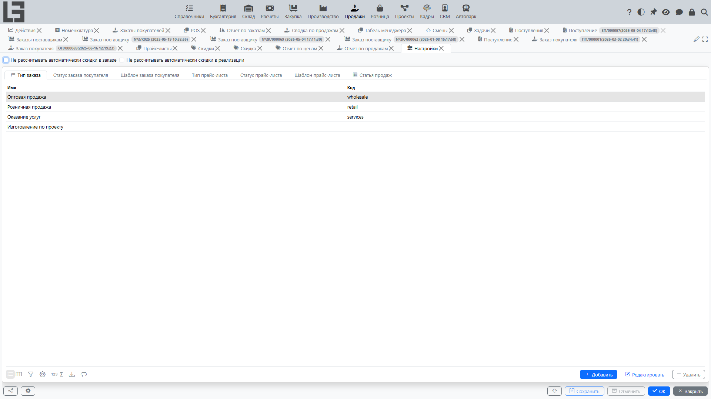

## Где находится

Откройте **«Продажи» → «Настройка» → «Настройки»**.

## Что обычно настраивается

### Типы заказа

Для каждого типа заказа можно задать:

- **нумератор** — формат и счётчик номеров;
- **валюту по умолчанию** и признак «цена включает налоги»;
- **тип отгрузки** (если включён модуль Склад) — какой документ создаётся при подтверждении заказа;
- **тип производственного заказа** и/или **тип закупочного заказа** — для автоматического создания связанных документов;
- **шаблон письма** — тема, тело и адрес копии для действия «Отправить» (см. [статус «Отправлен»](workflow-and-statuses.md));
- **запрет блокировки при активных отгрузках** и **запрет блокировки при неполной отгрузке** — ограничения перехода в статус «Заблокирован».

### Глобальные настройки модуля

На форме настроек модуля доступны общие переключатели:

- **«Не рассчитывать скидки автоматически в заказе»** — отключает автоматический пересчёт скидок при изменении строк (полезно при ручном управлении скидками);
- **«Не рассчитывать скидки автоматически в реализации»** — то же для документов реализации.

См. также: [Скидки](discounts.md#автоматический-пересчёт-скидок).

### Прайс-листы

- **Типы прайс-листа** — категории, по которым строится список (например, «Стандартный», «Акционный»);
- **Виды цены** — используются в строках прайс-листов и заказов для определения цены;
- **Шаблоны печати** — для печати прайс-листов и ценников.

### Что ещё

- параметры печати (шаблоны для заказов и сопроводительных документов);
- доступность отдельных действий в зависимости от статусов.

Рекомендация: сначала настройте типы заказов и нумераторы, затем виды цены и прайс-листы, и в последнюю очередь — скидки (они опираются на типы цен и категории).