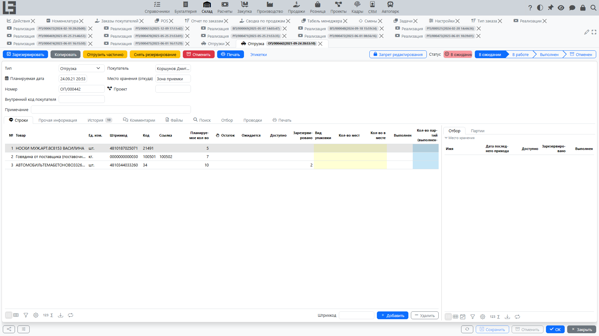

[Отгрузка](../inventory/shipments.md) фиксирует передачу товара покупателю и движение по месту хранения.

## Где находится

Отгрузки относятся к модулю **«Склад»** — список отгрузок находится в **«Склад» → «Операции» → «Отгрузки»**. Отгрузка, связанная с заказом покупателя, создаётся из заказа автоматически (см. ниже).

## Связь с заказом

Отгрузка может создаваться на основании заказа покупателя. В этом случае:

- подставляются [контрагент](../masterdata/partners.md) и адрес доставки;
- подставляется [место хранения](../inventory/locations.md);
- строки отгрузки формируются по строкам заказа.

## Связь отгрузок и заказов покупателя: как работает в системе

Ниже описана логика связи «заказ покупателя ↔ отгрузки».

### Связь на уровне строк

Связь отгрузки с заказом хранится не только «шапкой», но и **через строки**:

- каждая строка отгрузки связана с конкретной строкой заказа;
- по этой связи система считает:
  - сколько зарезервировано под строку заказа;
  - сколько уже отгружено;
  - сколько осталось отгрузить.

Практический смысл: можно отгружать один заказ несколькими отгрузками и частями.

### Остаток к отгрузке

Для строки заказа система показывает колонки:

- **«Зарезервировано»** — количество в активных отгрузках;
- **«Выполнен»** — количество по выполненным (не отменённым) отгрузкам.

Остаток к отгрузке рассчитывается как количество строки заказа (с учётом коэффициента упаковки/единицы) минус отгруженное количество — это расчётное значение, отдельной колонки нет.

Если по строке отгружено больше, чем в заказе, система выдаст ошибку.

Также в списке заказов отображаются агрегированные колонки **«Статус отгрузки»** и **«Статус реализации»**.

### Статусы отгрузки и влияние на запасы

Отгрузка проходит статусы **«Черновик» → «В ожидании» → «В работе» → «Выполнен»** (и может получить статус **«Отменен»**). Автоматически создаваемая резервная отгрузка стартует в статусе «В ожидании».

- В статусах «В ожидании» и «В работе» отгрузка только **резервирует** запас под заказ — товар ещё не списан.
- Списание товара с места хранения происходит только при переводе отгрузки в статус «Выполнен».

Перевести отгрузку дальше по статусам позволяют действия **«В работу»** (из «Черновика» в «В ожидании»), **«Зарезервировать»** (резервирует запас; когда все строки полностью зарезервированы, отгрузка автоматически переходит в статус «В работе») и **«Провести»**. Также доступны действия **«Отгрузить частично»** и **«Снять резервирование»**. Проверить запас помогают колонки строк **«Остаток»**, **«Ожидается»** и **«Доступно»** (см. [отгрузки](../inventory/shipments.md)).

### «Резервная» отгрузка заказа (статус «В ожидании»)

В системе предусмотрен механизм автоматической «резервной» отгрузки, которая поддерживается в актуальном состоянии по заказу.

Условия, при которых она создаётся/обновляется:

- заказ находится в статусе подтверждения;
- у типа заказа задан тип отгрузки;
- в заказе выбрано место хранения;
- по заказу есть что отгружать (остаток к отгрузке больше нуля).

Как это выглядит для пользователя:

1. Вы подтверждаете заказ.
2. Система создаёт (или находит) ожидающую отгрузку по этому заказу.
3. В ожидающей отгрузке автоматически поддерживаются:
   - [контрагент](../masterdata/partners.md);
   - подразделение (если используется);
   - плановая дата;
   - адрес доставки;
   - [место хранения](../inventory/locations.md).

### Как формируются строки в ожидающей отгрузке

При создании/обновлении ожидающей отгрузки система:

- добавляет строки отгрузки для тех строк заказа, по которым есть остаток к отгрузке;
- в строку отгрузки подставляет товар (с учётом преобразования номенклатуры, если оно используется);
- фиксирует **«Планируемое кол-во»** по строке отгрузки, равное текущему остатку к отгрузке.

Если по строке заказа остаток стал равен нулю (всё отгрузили), соответствующая строка отгрузки удаляется.
Если в ожидающей отгрузке не осталось строк, такая отгрузка удаляется.

После формирования строк система выполняет предварительную проверку наличия по ожидающей отгрузке.

### Несколько отгрузок по одному заказу

Один заказ может быть связан с несколькими отгрузками. Это бывает при частичном выполнении отгрузки (система создаёт новую отгрузку «В ожидании» на остаток) или при использовании действия **«Отгрузить частично»**.

В карточке заказа отображается список связанных отгрузок.
В нижней части карточки отгрузки отображается ссылка на связанные заказы — номера заказов, по которым можно перейти.

Групповое действие **«Создать реализацию»** в списке отгрузок создаёт одну реализацию по выполненным количествам выбранных отгрузок.

### Ограничения при блокировке заказа

В типе заказа могут быть включены дополнительные ограничения:

- запрет блокировки заказа, если по нему есть активные отгрузки;
- запрет блокировки заказа, если он отгружен не полностью.

Если ограничения включены, система не позволит выполнить блокировку.

### Себестоимость и надбавка

Когда отгрузка связана с заказом покупателя, в строках заказа также доступны колонки **«Себестоимость»**, **«Надбавка»** и **«Надбавка, %»** (себестоимость берётся из списания по отгрузке либо из плановой себестоимости номенклатуры). Эти значения попадают в [отчёт по заказам](reports.md).

## Создание отгрузки на основании реализации

Сценарий «отгрузка из реализации» описан на отдельной странице: [Создание отгрузки на основании реализации](../invoicing/shipments-from-invoice.md).

## Типовой сценарий

1. Подтвердите заказ покупателя (у типа заказа должен быть задан **«Тип отгрузки»**) — резервная отгрузка создастся автоматически.
2. Откройте отгрузку на вкладке **«Отгрузки»** заказа.
3. Проверьте количество по строкам.
4. Выполните **«Зарезервировать»** — когда все строки полностью зарезервированы, отгрузка переходит в статус «В работе»; затем выполните **«Провести»**, чтобы списать товар с места хранения.