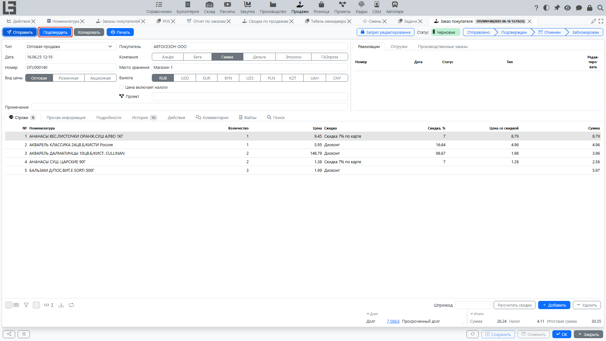

В разделе «Продажи» заказ покупателя проходит через статусы. Статусы определяют:

- можно ли редактировать заказ;
- можно ли отменить заказ;
- можно ли создавать связанные документы (отгрузки, реализации, производственные/закупочные заказы).

Возможность редактирования заказа в конкретном статусе настраивается флагом **«Запрет редактирования»** в разделе **«Продажи» → «Настройка» → «Настройки»**. Кроме того, отдельный заказ можно закрыть от редактирования переключателем с замком в его карточке.

## Типовой процесс

1. **Черновик**
   - заказ можно редактировать; можно добавлять и удалять строки;
   - это статус по умолчанию для нового заказа.
2. **Отправлен**
   - заказ отправлен покупателю действием **«Отправить»**;
   - письмо по электронной почте отправляется, только если в типе заказа задан **«Шаблон по умолчанию»**; иначе действие только меняет статус;
   - тема, тело письма, шаблон по умолчанию (печатная форма-вложение) и адрес копии настраиваются в типе заказа; адрес копии получает скрытую копию письма;
   - переход доступен из «Черновика»; из «Отправлен» можно сразу перейти в «Подтвержден».
3. **Подтвержден**
   - заказ считается согласованным; переход доступен из «Черновика» или «Отправлен»;
   - по нему можно создавать [отгрузки](shipments.md) и [реализации](invoices.md); пока есть нереализованное количество, в заказе доступна кнопка **«Создать реализацию»**, а в строках отображаются индикаторы **«Реализовано»** и **«Оплачено»**;
   - если в типе заказа задан **«Тип отгрузки»**, при подтверждении автоматически создаётся резервирующая [отгрузка](shipments.md);
   - если в типе заказа заданы **«Тип заказа на производство»** и флаг **«Автоматически создавать производственный заказ»**, [производственные заказы](../manufacturing/workflow.md) создаются автоматически;
   - [закупочные заказы](../purchase/purchase.md) автоматически не создаются — строки подтверждённых заказов покупателей добавляются вручную в форме заказа поставщику.
4. **Закрыт**
   - заказ закрыт для дальнейшей работы (например, после полного выполнения); закрытые заказы скрываются фильтром по умолчанию **«Открыт»** в списке заказов;
   - переход доступен только из «Подтвержден»;
   - в типе заказа можно включить ограничения: **«Запретить закрытие заказов с действующими отгрузками»**, **«Запретить закрытие заказов, которые не полностью отгружены»** и **«Запретить закрытие заказов, которые не полностью оплачены»**;
   - если эти ограничения выключены, при закрытии заказа его действующая резервирующая отгрузка удаляется.
5. **Отменен**
   - заказ закрыт и не выполняется;
   - переход доступен из любого статуса, кроме «Черновика» и «Отменен».

Точные названия статусов и ограничения зависят от конфигурации.

## Ограничения и проверки

Обычно действуют правила:

- нельзя удалить строку заказа, если из неё уже создан производственный заказ;
- нельзя отменить заказ, если по нему есть «запущенные» процессы (например, действующие производственные заказы);
- при попытке закрыть заказ система проверит ограничения, заданные в типе заказа (действующие отгрузки, неполная отгрузка и/или неполная оплата), и выдаст сообщение, если закрытие запрещено.

## Рекомендации

- подтверждайте заказ только после проверки цен, места хранения и условий доставки;
- если заказ нужно закрыть без выполнения, используйте отмену, а не удаление.