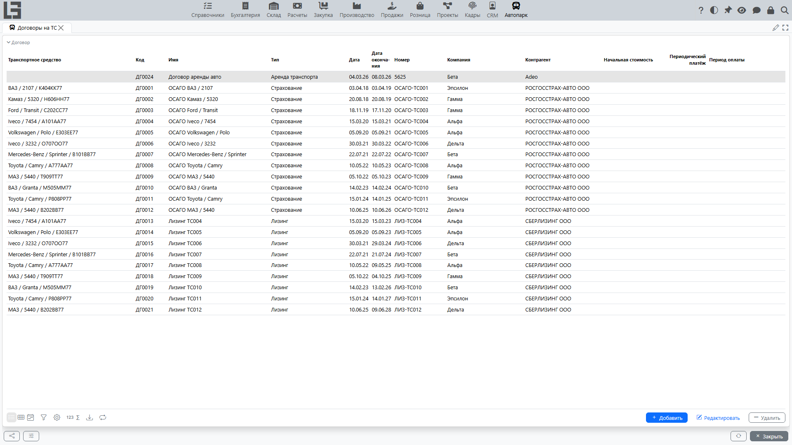

Раздел предназначен для учёта договоров, связанных с транспортными средствами (например, аренда, лизинг, страхование — в зависимости от принятых в организации типов договоров).

Договор можно использовать как карточку учёта условий: сроки, контрагент, суммы (если применимо) и связь с конкретным транспортным средством.

## Где находится

Откройте **«Автопарк» → «Операции» → «Договоры на ТС»**.

В списке отображаются договоры, тип которых допускает привязку транспортного средства.

## Создание договора

Договор можно создать:

- из списка **«Договоры на ТС»** (кнопка **Добавить**);
- из карточки транспортного средства (в блоке **Договоры** — кнопка **Добавить**).

Рекомендуемый вариант для «привязки к конкретному ТС» — создавать договор из карточки транспортного средства: тогда транспортное средство будет заполнено автоматически.

При заполнении укажите:

- тип договора (если в системе заведён только один тип, он подставляется автоматически; иначе выберите нужный тип);
- **дату** (обязательное поле) и дату окончания;
- **номер** (обязательное поле);
- **компанию** и **контрагента** (обязательные поля; компания подставляется по умолчанию);
- суммы (например, **начальная стоимость** и **периодический платёж** с **периодом оплаты** — если это предусмотрено типом договора).

В карточке договора также доступны вкладка **Текст** (для текста договора), блок **Файлы** (вложения — сканы, приложения) и панель **Комментарии**.

### Тип договора и доступность поля «Транспортное средство» 

В некоторых организациях не все типы договоров предполагают привязку к транспортному средству. Тогда:

- поле выбора транспортного средства может быть скрыто или недоступно;
- при попытке указать транспортное средство для неподходящего типа договора система выдаст сообщение **«Выбранный тип контракта не позволяет использовать транспортное средство»**.

Если вы столкнулись с таким ограничением — проверьте, корректно ли выбран тип договора, или обратитесь к администратору для настройки типов.

### Сроки и контроль окончания

Для контроля действующих договоров важно заполнять даты начала и окончания. Если договор завершился, но дата окончания не заполнена, он может попадать в выборки как «действующий».

Если в договоре используются периодические платежи (например, ежемесячный платёж), заполните также **период оплаты** — это помогает корректно интерпретировать условия.

## Просмотр договоров в карточке транспортного средства

В карточке транспортного средства отображается список связанных договоров. Это удобно для контроля сроков и условий по конкретному транспортному средству.

Отсюда же удобно:

- быстро перейти в карточку договора;
- добавить новый договор, относящийся к выбранному ТС (кнопка **Добавить**).