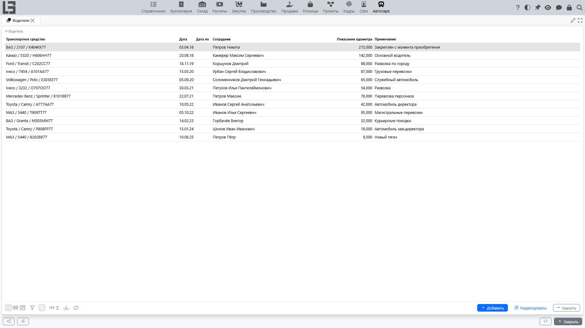

Раздел предназначен для назначения водителей на транспортные средства и ведения истории назначений.

Назначение водителя хранится как отдельная запись с периодом действия. Это позволяет видеть, кто и когда был закреплён за конкретным транспортным средством.

## Где находится

Откройте **«Автопарк» → «Операции» → «Водители»**.

## Назначение водителя на транспортное средство

Назначение задаётся как запись с периодом действия.

1. Нажмите **Добавить**.
2. Укажите:
   - транспортное средство;
   - **дату** (начала) и при необходимости **дату по**;
   - сотрудника (водителя);
   - [показания одометра](service.md) (если требуется);
   - примечание (при необходимости).
3. Сохраните запись.

При выборе транспортного средства поле **«Сотрудник»** заполняется предыдущим водителем этого ТС (если он был) — замените его на нового водителя. **«Дата»** по умолчанию равна текущей дате.

### Как заполнять период назначения

- **Дата** — дата начала ответственности/использования ТС.
- **Дата по** — дата окончания назначения. Дата окончания включается в период: в этот день водитель ещё считается назначенным, поэтому новое назначение лучше начинать со следующего дня.

Если водитель назначен на неопределённый срок, дату окончания обычно оставляют пустой. Когда водитель меняется, прошлое назначение закрывают датой окончания.

## Замена водителя (типовой сценарий)

Чтобы корректно сменить водителя и сохранить историю:

1. Откройте список назначений (раздел **«Водители»** или блок **Водители** в карточке транспортного средства).
2. Найдите актуальное назначение и заполните **дату по** (например, датой передачи ТС).
3. Создайте новое назначение с новой **датой** и выберите нового водителя.

Рекомендуется избегать пересечения периодов назначений по одному транспортному средству, чтобы «текущий водитель» определялся однозначно.

## Контроль актуального водителя

При просмотре списка транспортных средств в отдельных случаях отображается текущий водитель (на текущую дату). Если период назначения завершён, водитель считается не назначенным.

Если в списке транспортных средств водитель не отображается или отображается неверно:

- проверьте **дату** и **дату по** у назначений;
- убедитесь, что нет перекрывающихся периодов;
- убедитесь, что прошлое назначение закрыто датой окончания.

## Рекомендации по ведению истории

- Для корректного определения текущего водителя закрывайте прошлое назначение, указывая **дату по**.
- Если водитель меняется, создавайте новое назначение с новой датой.

Дополнительно:

- Если в вашей организации фиксируются показания одометра, удобно указывать [показания одометра](service.md) при смене водителя — это помогает сверять пробег и обслуживать ТС по регламенту.