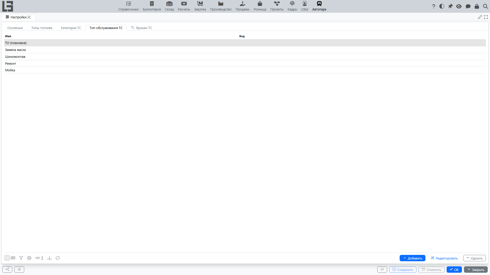

В разделе «Автопарк» используются справочники, которые определяют варианты выбора в карточках транспортных средств и обслуживаний. Здесь ведутся только справочники автопарка; общие справочники (типы договоров, компании, контрагенты) настраиваются в общих разделах системы.

## Где находится

Справочники доступны в группе **«Автопарк» → «Настройка»**. В этой группе находятся форма **«Настройки»**, а также отдельные пункты **«Модели ТС»** и **«Производители ТС»**.

Доступ к настройке, как правило, ограничен правами администратора или ответственного за справочники.

## Форма «Настройки»

Форма **«Настройки»** разбита на вкладки. На вкладке **«Основные»** задаются общие параметры раздела (например, нумератор, по которому формируются коды транспортных средств). Остальные вкладки — справочники (состав зависит от конфигурации):

- **Типы топлива** — варианты для поля «Тип топлива» в карточке транспортного средства.
- **Категории ТС** — классификация транспорта (например, легковые, грузовые, спецтехника).
- **Тип обслуживания ТС** — классификация обслуживаний (плановое обслуживание, ремонт и т. п.).
- **Ярлыки ТС** — дополнительные метки для фильтрации и контроля.

Для справочников обычно доступны действия **Добавить**, **Редактировать**, **Удалить**.

Рекомендации по ведению справочников:

- договаривайтесь о едином наименовании (без дублей и разных написаний одного и того же значения);
- используйте понятные названия, чтобы пользователи могли быстро выбрать нужный вариант;
- если в справочнике есть поле «Код» — заполняйте его стабильно (часто используется для интеграций и обмена данными).

## Производители и модели ТС

**«Производители ТС»** и **«Модели ТС»** — это отдельные пункты в группе **«Настройка»** (рядом с **«Настройки»**), каждый открывается отдельным списком.

Рекомендуемый порядок заполнения:

1. Сначала заведите производителей.
2. Затем добавляйте модели, выбирая производителя.

Практический совет: отображаемое имя модели система формирует автоматически в виде «Производитель / Модель», поэтому выбирайте производителя из справочника и вводите только название модели — это упрощает поиск и исключает дубли.