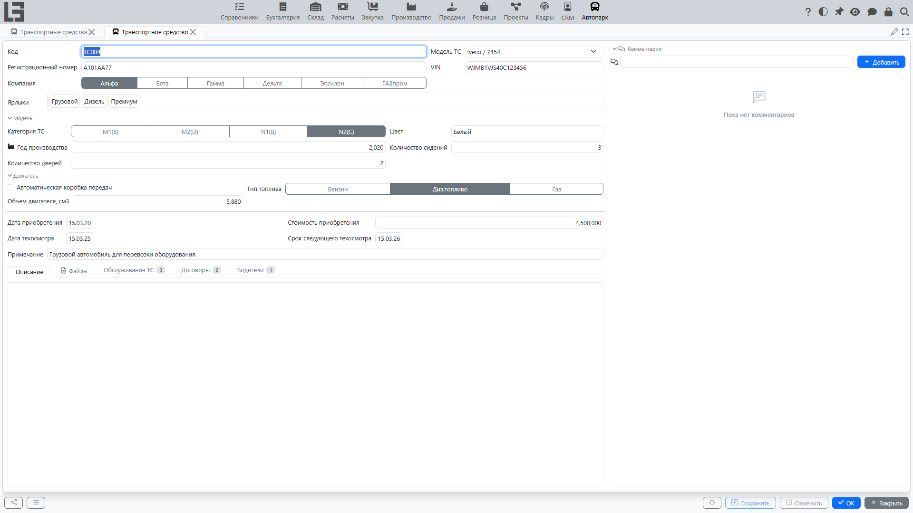
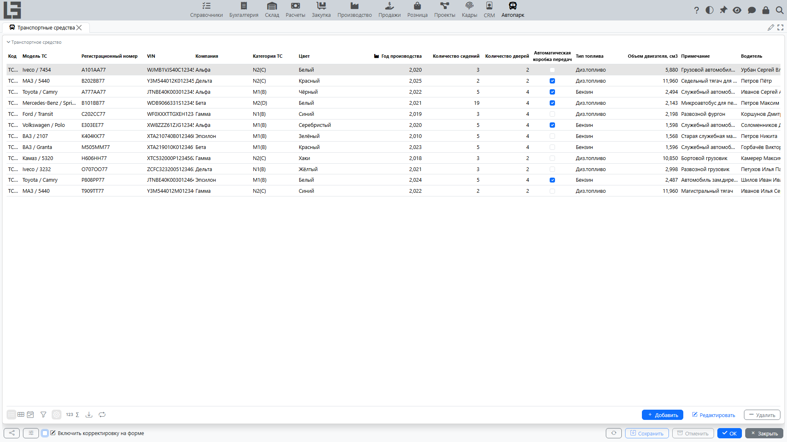

Раздел предназначен для ведения списка транспортных средств и просмотра всей связанной информации: [назначений водителей](drivers.md), [обслуживаний](service.md), [договоров](contracts.md) и приложенных файлов.

Карточка транспортного средства — «точка сборки» по конкретному автомобилю: в ней удобно контролировать, кто сейчас закреплён за ТС, какие были обслуживания, какие договоры действуют, а также хранить документы.

## Где находится

Откройте **«Автопарк» → «Операции» → «Транспортные средства»**.

Чтобы открыть карточку транспортного средства, выберите строку в списке и выполните **Редактировать** (или откройте запись двойным щелчком, если это принято в вашей организации).

## Список транспортных средств

В списке обычно доступны основные сведения о ТС (модель, регистрационный номер, компания, категория, тип топлива и т. п.), а также текущий [водитель](drivers.md) и [ярлыки](settings.md).

Кроме того, в списке могут отображаться колонки по каждому [типу обслуживания ТС](settings.md) (дата и показания одометра последнего обслуживания этого типа) и по каждому типу договоров на ТС (номер и даты последнего договора этого типа) — состав колонок зависит от заведённых типов и версии системы.

Типовые действия в списке:

- **Добавить** — добавить новое транспортное средство.
- **Редактировать** — открыть карточку выбранного ТС.
- **Удалить** — удалить запись (если разрешено правами и нет ограничений по связанным данным).

Для быстрого поиска и контроля используйте фильтры и сортировку. На практике чаще всего фильтруют:

- по организации;
- по категории ТС;
- по ярлыкам;
- по текущему водителю (если отображается в списке).

## Создание транспортного средства

1. Нажмите **Добавить**.
2. Заполните обязательные и основные реквизиты (в зависимости от настроек):
   - модель ТС;
   - регистрационный номер;
   - компания;
   - категория ТС, тип топлива, год выпуска и прочие характеристики.
3. Сохраните запись.

### Рекомендации по заполнению

- **Модель**. Если нужной модели нет, её обычно добавляют в разделе **«Автопарк» → «Настройка»** (при наличии прав).
- **Регистрационный номер**. Вводите в едином формате, принятом в организации, чтобы упрощать поиск.
- **VIN**. Если используется, заполняйте по документам, без пробелов и лишних символов.
- **Категория, тип топлива, год выпуска и прочие характеристики** помогают формировать отчёты и планировать обслуживание.

## Редактирование и удаление

Чтобы изменить данные:

1. В списке выберите транспортное средство.
2. Нажмите **Редактировать**.
3. Внесите изменения и сохраните карточку.

Удаление, как правило, ограничено правами. Учтите: вместе с транспортным средством удаляются связанные с ним назначения водителей, обслуживания, файлы и комментарии, а в договорах очищается ссылка на ТС. Поэтому для ТС с историей вместо удаления лучше использовать организационные правила (например, пометку в примечании или ярлык «Не используется»), если это принято в вашей компании.

## Ярлыки

Ярлыки используются как дополнительные метки для удобства фильтрации и контроля. Список доступных ярлыков настраивается в разделе [Настройка](settings.md).

Чтобы назначить ярлыки транспортному средству:

1. Откройте карточку транспортного средства.
2. В поле ярлыков выберите нужные значения.

Примеры применения ярлыков:

- разделение ТС по назначению (служебные, резервные);
- контроль статуса (в ремонте, лизинг/аренда);
- быстрые выборки в списках.

## Файлы

К транспортному средству можно прикреплять файлы (например, фотографии, сканы документов).

Типовой порядок работы:

1. Откройте карточку транспортного средства.
2. Перейдите на вкладку **Файлы**.
3. Нажмите **Файл**, выберите файл и при необходимости заполните описание.

Доступность добавления/удаления файлов зависит от прав.

Рекомендации:

- прикладывайте документы, которые важно быстро найти (страховка, договор, доверенности, фотографии состояния);
- в описании файла указывайте, что это за документ и за какой период он действует.

## Связанные данные в карточке транспортного средства

В карточке транспортного средства, как правило, доступны блоки:

- **[Водители](drivers.md)** — назначения водителей с датами.
- **[Обслуживания ТС](service.md)** — история обслуживаний и затрат.
- **[Договоры](contracts.md)** — привязанные договоры.

Для добавления записи в связанном блоке используйте **Добавить** в соответствующей таблице.

Справа в карточке доступна панель **Комментарии** — в ней можно вести обсуждение по конкретному транспортному средству.

### Как понять, кто «текущий водитель»

Текущий водитель определяется по назначениям водителей на текущую дату. Если назначение закрыто датой окончания, то после этой даты водитель считается не назначенным.

Если текущий водитель отображается некорректно:

1. Откройте блок **Водители** в карточке ТС.
2. Проверьте даты начала/окончания назначений.
3. Убедитесь, что периоды не пересекаются и что предыдущее назначение закрыто датой окончания.